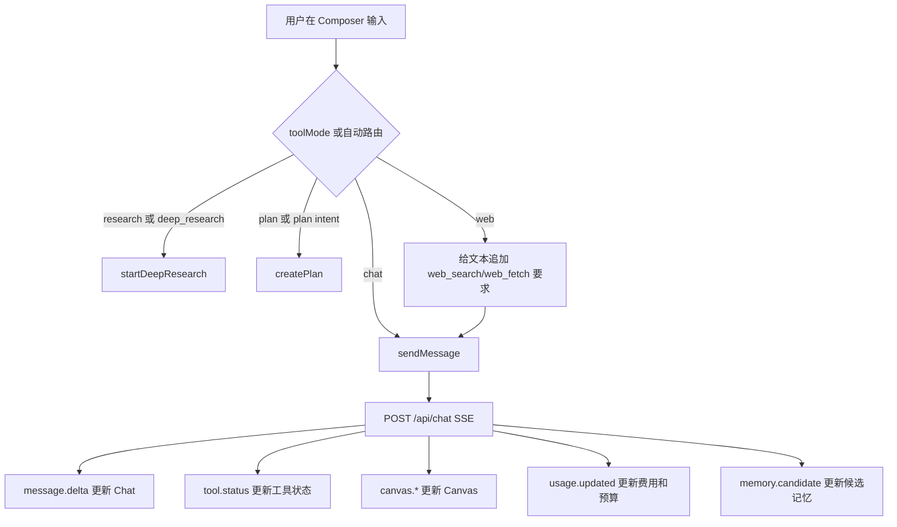
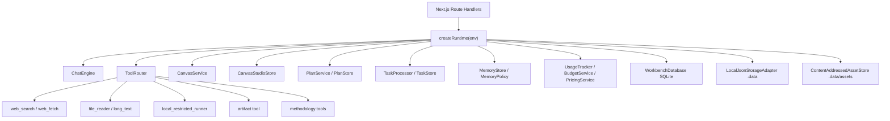

# Pinocchio 项目说明

日期：2026-05-08
目标读者：产品、前端、后端、Agent 能力设计、后续接手开发者

## 1. 项目定位

Pinocchio 是一个面向复杂 AI 工作流的本地优先工作台。它不是单纯聊天窗口，也不是单独的文档编辑器，而是把对话、推理、工具调用、计划执行、长内容创作、Canvas Studio、记忆、文件、插件和 MCP 能力组织在同一个工作空间里。

核心定位可以概括为：

| 维度 | 说明 |
|---|---|
| 产品形态 | AI 工作台，包含聊天、任务、计划、Canvas Studio、设置、历史、卡片组织 |
| 核心对象 | Conversation、Message、Plan、Task、Canvas、Canvas Project、Artifact、Memory、Card |
| 创作方向 | 长文档、代码、应用原型、图表、图示、PPT、HTML Artifact、未来的视频和导出产物 |
| 运行方式 | Next.js Web 应用 + Core Runtime + 本地 SQLite/JSON 存储 + 可选 MCP Server |
| 模型入口 | DeepSeek V4 系列模型，支持 Flash/Pro、thinking 开关、reasoning effort |
| 设计重点 | 把 AI 输出从一次性聊天内容提升为可编辑、可版本化、可审查、可导出的项目资产 |

## 2. 应用功能总览

### 2.1 功能地图

| 功能域 | 用户能做什么 | 主要前端入口 | 后端模块 | 关键数据 |
|---|---|---|---|---|
| AI 聊天 | 发起普通对话、流式接收回复、查看工具状态、查看 reasoning 摘要 | 全屏聊天区、Chat Card、Composer | `ChatEngine`、`PromptManager`、`IntentRouter`、`ToolRouter` | `conversations`、`messages` |
| 模型控制 | 切换 V4 Flash/Pro、thinking 开关、High/Max effort | Composer 顶部控制条 | `DeepSeekLLMClient`、`MockLLMClient` | `ChatRequest.model`、`thinking` |
| 能力路由 | 自动识别是否需要 Canvas、联网、深研、代码、多 Agent、教学 | Composer 提交和 capability hint | `IntentRouter`、`inferChatRouteAction` | `CapabilityFlags` |
| 文件上传 | 上传 txt/md/json/csv/pdf/图片，供模型读取和引用 | Composer 附件按钮 | `FileStore`、`file_reader` tool | `UploadedFile`、chunks |
| 工具调用 | 当前时间、网页搜索/抓取、文件读取、长文本分析、代码执行、记忆、Artifact、方法论工具 | MessageStream 工具状态区 | `ToolRouter` 和 `packages/core/src/tools/*` | `ToolCallState` |
| Canvas | 把长内容、代码、图表、PPT 等沉淀为右侧可编辑画布 | Canvas Card、Canvas Panel | `CanvasService`、`CanvasStore`、`CanvasRevisionStore` | `canvases`、revisions |
| Canvas Studio | 将 Canvas 升级为项目容器，管理版本、节点、文件、资产、审查、导出任务 | `CanvasStudioPanel` | `CanvasStudioStore`、`CanvasAssetRegistry`、`ContentAddressedAssetStore` | `canvas_projects` 系列表 |
| Artifact 兼容 | 创建/更新 markdown/html/code/report/newspaper Artifact，并同步到 Canvas Project | Artifact API、Artifact tool | `ArtifactManager` | Artifact JSON、Canvas Project |
| 计划生成 | 根据 prompt 生成计划，可编辑、保存、执行 | Composer Plan 按钮、Plan Card | `PlanService`、`PlanStore` | `plans`、`plan_steps` |
| 计划执行 | 把计划转为后台任务，执行后产出 Canvas 或结果 | Plan Card Run | `TaskProcessor`、`TaskStore` | `AiTask`、`AiTaskEvent` |
| 深度研究 | 发起 research.deep 任务，搜索/抓取资料并形成 Canvas | Composer 深研按钮 | `DeepResearchService`、`TaskProcessor` | `tasks`、`canvases` |
| 记忆系统 | 识别候选记忆、用户确认后持久保存，可删除 | Settings/Memory API、聊天事件 | `MemoryPolicy`、`MemoryStore`、`memory` tool | memory JSON |
| 卡片工作区 | 聊天、计划、Canvas 以可移动卡片形式管理，支持隐藏、重置、全屏 | `CardStage`、Dock | `CardStore` | `cards` |
| 设置 | 保存 API Key、预算、插件目录、Obsidian 路径、头像、语言、主题 | Settings Panel、Dock | `envFileStore`、`PricingService`、`PluginManager` | `.env`、settings |
| Obsidian 导出 | 将 Canvas 导出到配置的 Obsidian vault | Canvas Toolbar | `ObsidianVaultBridge`、`obsidian_export` tool | vault 文件 |
| MCP Server | 将 Pinocchio 工具暴露为 MCP stdio server | `pnpm mcp` | `packages/mcp-server` | MCP tool schema |

### 2.2 用户工作流

| 场景 | 典型流程 | 输出结果 |
|---|---|---|
| 普通问答 | 输入问题，选择模型，发送，查看流式回复 | 一组 conversation messages |
| 长文创作 | 输入“写一份方案/报告/文章”，系统判断或用户打开 Canvas 模式 | Canvas 文档、版本、Canvas Project |
| 代码/HTML 原型 | 输入需求或粘贴代码，切到 coding 或 Canvas 模式 | 代码块、HTML iframe 预览、可编辑 Canvas |
| 计划驱动任务 | 输入目标，点击计划模式，生成 Plan，编辑后 Run | Plan、Task、Task Events、Canvas 结果 |
| 深度研究 | 输入研究主题，点击 Deep Research | research task、搜索资料、研究 Canvas |
| 复盘和整理 | 通过 Dock 打开历史、Canvas 列表、Plan 列表、Cards 管理 | 已归档/未归档卡片、历史会话 |
| 资产化创作 | 在 Canvas Studio 中审查、导出、管理版本/资产 | review report、export job、output record |

## 3. 前端交互逻辑

### 3.1 页面入口

| 路径 | 组件 | 作用 |
|---|---|---|
| `apps/web/app/page.tsx` | `ChatWindow` | Web 应用首页入口 |
| `apps/web/components/ChatWindow.tsx` | `WorkbenchShell` | 只负责挂载工作台壳 |
| `WorkbenchShell.tsx` | 顶层交互容器 | 管理布局、Dock、卡片、面板、主题、语言、发送动作 |
| `useWorkbenchController.ts` | 前端状态控制器 | 拉取数据、提交聊天、刷新 Canvas/Plan/Task、维护本地状态 |

### 3.2 工作台布局

当前前端采用两种布局模式：

| 布局模式 | 说明 | 适合场景 |
|---|---|---|
| A Mode | 全屏聊天作为主背景，Plan 和 Canvas 作为浮动卡片叠加 | 默认聊天、边聊边产出 |
| B Mode | Chat、Plan、Canvas 都作为可移动卡片 | 多窗口并排、对照编辑、复杂任务管理 |

底部/侧边的 `AutoHideDock` 是主要导航控制层。Dock 内部按分组组织：

| Dock 分组 | 控件 | 行为 |
|---|---|---|
| Layout | A/B 布局切换 | 在全屏聊天和全卡片工作台之间切换 |
| Workspace | 新会话、聊天、Plan、Canvas | 新建 conversation，显示对应卡片或面板 |
| Panels | Timeline、Organize、Settings | 打开历史、卡片管理、设置面板 |
| Appearance | 主题、语言 | 切换 light/dark，切换 zh/en |

### 3.3 卡片系统

Pinocchio 的主要生产对象都被包装为 Card：

| Card 类型 | Card ID | 来源对象 | 前端组件 | 交互能力 |
|---|---|---|---|---|
| Chat | `chat` | 当前 conversation messages | `ChatCard` | 滚动、消息锚点、工具状态、Composer |
| Plan | `plan:{id}` | `Plan` | `PlanCard` | 编辑计划、保存计划、运行计划、查看任务摘要 |
| Canvas | `canvas:{id}` | `Canvas` | `CanvasWorkspace` | 改标题、编辑、AI 操作、历史、导出、Studio 审查 |

卡片行为由 `CardStage` 管理：

| 行为 | 说明 |
|---|---|
| 移动 | 卡片头部绑定 `moveProps`，支持拖动 |
| 聚焦 | 点击或打开卡片时提升 `zIndex` |
| 隐藏 | 关闭卡片后保留对象，只是不显示 |
| 重置 | 恢复默认位置和尺寸 |
| 全屏 | 单卡片进入更大阅读/编辑状态 |
| 持久化 | 每个 conversation 的卡片布局保存到 `localStorage` |
| 视口适配 | resize 时自动把卡片限制在可见区域内 |

### 3.4 Composer 输入区

Composer 是所有 AI 工作流的统一入口。

| 控件 | 状态字段 | 行为 |
|---|---|---|
| 文本输入 | `text` | Enter 发送，Shift+Enter 换行，自动高度 |
| Send | `busy`、`text` | 忙碌或空文本时禁用 |
| V4 Flash/Pro | `model` | 在 `deepseek-v4-flash` 和 `deepseek-v4-pro` 间切换 |
| Thinking | `thinking` | 开关 reasoning |
| Effort | `reasoningEffort` | thinking 开启时在 `high` 和 `max` 间切换 |
| Deep Research | `toolMode=research` | 发送后创建 `research.deep` task |
| Plan | `toolMode=plan` | 发送后调用计划生成 |
| Web | `toolMode=web` | 给用户文本加上先搜索/抓取再回答的指令 |
| Canvas | `artifactMode` | 要求长内容进入 Canvas/Artifact 输出 |
| Upload | `files` | 选择文件并上传到 `/api/files/upload` |
| Token Meter | `useTokenUsage` | 显示草稿、历史、上下文、剩余 token 和账单摘要 |
| Capability Hints | `capabilityFlags` | 显示当前请求触发的能力标签 |

发送逻辑：



### 3.5 聊天流式事件

前端通过 `streamChat` 消费 `/api/chat` 的 Server-Sent Events。核心事件如下：

| 事件 | 前端处理 | 用户感知 |
|---|---|---|
| `message.delta` | 增量写入 assistant message | 回复逐字/逐段出现 |
| `message.done` | 写入最终内容和 usage | 回复完成 |
| `reasoning.raw` | 写入 reasoning 字段 | 可在 UI 中分离展示推理内容 |
| `reasoning.summary` | 更新状态栏 | 看到简短推理摘要 |
| `tool.status` | upsert tool call state | 看到工具运行、成功、失败 |
| `capability.hints` | 更新能力标签 | 看到系统判定的能力路径 |
| `usage.updated` | 更新账单和预算 | 看到本轮费用、缓存命中、预算状态 |
| `artifact.created` | 替换聊天摘要 | 提示已生成 Artifact/Canvas |
| `canvas.started` | 新建或激活 Canvas | 右侧出现生成中的画布 |
| `canvas.text_delta` | 追加 Canvas 文本 | Canvas 边生成边更新 |
| `canvas.patch` | 更新 block AST | 结构化内容刷新 |
| `canvas.done` | 保存最终 Canvas | Canvas 完成并可编辑/导出 |
| `canvas.error` | 显示错误状态 | 用户知道生成失败原因 |
| `memory.candidate` | 添加候选记忆 | 后续可确认保存 |
| `error` | 标记失败 | 消息状态变为 failed |

### 3.6 Canvas 交互

Canvas 是持久创作对象，前端主要由 `CanvasWorkspace` 组织：

| 区域 | 组件 | 功能 |
|---|---|---|
| Header | 内联 title input | 改名、Enter 提交、Esc 还原 |
| History | `CanvasHistory` | 切换同 conversation 下不同 Canvas |
| Toolbar | `CanvasToolbar` | 编辑、复制、恢复、AI 操作、导出 |
| Studio | `CanvasStudioPanel` | 显示项目、版本、资产、审查、导出状态 |
| Editor | `CanvasEditor` | 文档用 Tiptap，代码/应用用 CodeMirror |
| Preview | `CanvasRenderer` / `PptCanvasViewer` | 按 Canvas kind 渲染内容 |

Canvas 支持的内容形态：

| Canvas Kind | 用途 | 编辑器 | 渲染器 |
|---|---|---|---|
| `document` | 长文、方案、报告、说明文档 | Tiptap | Markdown/Block AST |
| `code` | 代码片段、脚本 | CodeMirror | Shiki 高亮 |
| `app` | HTML/前端原型 | CodeMirror | sandbox iframe |
| `diagram` | 图示、Mermaid | Tiptap/文本 | Mermaid |
| `chart` | 数据图表 | Tiptap/文本 | Vega-Lite |
| `ppt` | 演示稿 | Tiptap/文本 | `PptCanvasViewer` |

Canvas AI 操作来自 `CanvasAction`：

| 操作 | 说明 |
|---|---|
| `auto_layout` | 自动整理结构和排版 |
| `rewrite` | 改写 |
| `expand` | 扩写 |
| `shorten` | 缩写 |
| `tone` | 调整语气 |
| `translate` | 翻译 |
| `outline` | 生成提纲 |
| `extract_table` | 提取表格 |
| `to_chart` | 转图表 |
| `to_diagram` | 转图示 |
| `fix_code` | 修复代码 |
| `explain_code` | 解释代码 |

### 3.7 Canvas Studio 交互

Canvas Studio 是这次重构后的核心产品方向。它把单个 Canvas 升级为一个项目级容器。

| Studio Tab | 显示内容 | 当前交互 |
|---|---|---|
| Editor | files、nodes、编辑状态 | 打开/关闭编辑器 |
| Preview | streaming/render 状态 | 预览当前 Canvas |
| Assets | assets 数量和资源状态 | 资产上传/链接 API 已具备 |
| Versions | versions 数量和最新版本 | Canvas 更新时同步版本 |
| Review | review reports 数量 | 记录质量审查请求 |
| Export | outputs 数量和 export job 状态 | 创建导出任务 |

关键设计：

| 设计点 | 说明 |
|---|---|
| Canvas 和 Artifact 合并 | Artifact 退为 legacy/output 兼容层，Canvas Project 才是未来主对象 |
| 版本化 | 每次 Canvas 创建/更新可写入 `canvas_versions` |
| 项目化 | Project 下面管理 nodes、files、assets、jobs、outputs、reviews |
| 资产存储 | 大文件/图片/未来视频不直接塞入 SQLite，而是走 content-addressed file store |
| 方法论状态 | Qiushi 类方法论不做 prompt 拼接，而存成 workflow/phase/focus/state |
| 后续扩展 | Render/export pipeline 可以服务 HTML、PDF、PPTX、PNG、MP4/WebM、ZIP |

### 3.8 Plan 和 Task 交互

Plan Card 支持从“生成计划”到“执行计划”的闭环。

| 步骤 | 前端行为 | 后端行为 |
|---|---|---|
| 生成计划 | Composer 切 Plan，发送 prompt | `POST /api/plans/generate` 调用 `PlanService` |
| 展示计划 | 打开 `plan:{id}` 卡片 | 从 `plans` 读取 |
| 编辑计划 | Plan Card 切编辑态 | textarea + methodology controls |
| 保存计划 | blur 或保存动作 | `PATCH /api/plans/[id]` |
| 执行计划 | 点击 Run | `POST /api/plans/[id]/execute` 创建 `plan.execute` task |
| 任务更新 | controller 每 2.5 秒轮询 | `GET /api/tasks`、`GET /api/tasks/[id]/events` |
| 结果回填 | 发现 task 关联 Canvas | 自动拉取并打开 Canvas |

### 3.9 面板系统

| Panel | 入口 | 内容 |
|---|---|---|
| Timeline | Dock History | conversation 列表、选择、删除 |
| Canvas | Dock Canvas | 当前 conversation 的 Canvas 卡片列表 |
| Plan | Dock Plan | 当前 conversation 的 Plan 卡片列表 |
| Organize | Dock Archive | Card 管理、归档筛选 |
| Settings | Dock Settings | API Key、预算、插件、Obsidian、头像 |

### 3.10 设置交互

| 设置项 | 前端组件 | API | 存储/作用 |
|---|---|---|---|
| DeepSeek API Key | `ApiKeySection` | `POST /api/settings/api-key` | 写入环境配置，显示 masked key |
| Session Budget | `PricingBudgetSection` | `POST /api/settings/budget` | 控制本轮会话预算 |
| Plugin Dir | `IntegrationSettingsSection` | `POST /api/settings/integrations` | 加载本地插件工具 |
| Obsidian Vault | `IntegrationSettingsSection` | `POST /api/settings/integrations` | 启用 Obsidian 导出工具 |
| Assistant/User Avatar | `AvatarEditor` | local state | localStorage 保存头像偏好 |
| Language | Dock | localStorage | zh/en UI 文案 |
| Theme | Dock | localStorage + DOM class | light/dark |

## 4. 后端和运行时架构

### 4.1 Monorepo 结构

| 路径 | 包名 | 职责 |
|---|---|---|
| `apps/web` | `@pinocchio/web` | Next.js App Router、Web UI、Route Handlers、E2E |
| `packages/shared` | `@pinocchio/shared` | 前后端共享类型、Zod schema、SSE 事件协议 |
| `packages/core` | `@pinocchio/core` | Runtime、LLM、工具、存储、Canvas、Plan、Task、Memory |
| `packages/canvas` | `@pinocchio/canvas` | Canvas 包边界，当前主要提供类型/构建占位 |
| `packages/plan` | `@pinocchio/plan` | Plan 包边界，当前主要提供类型/构建占位 |
| `packages/mcp-server` | `@pinocchio/mcp-server` | MCP stdio server，复用 Core tools |

### 4.2 Runtime 依赖关系



### 4.3 ChatEngine 职责

| 子模块 | 职责 |
|---|---|
| `IntentRouter` | 从用户文本、历史、模式中推断 capability flags |
| `PromptManager` | 生成稳定 system prompt 和动态能力 prompt |
| `ContextManager` | 管理进入模型的上下文 |
| `ToolRouter` | 注册、schema 化、执行工具，返回结构化状态 |
| `CanvasDecisionService` | 判断何时创建/更新 Canvas |
| `CanvasService` | 创建、更新、恢复 Canvas，并同步 Canvas Project |
| `MemoryPolicy` | 判断候选记忆 |
| `UsageTracker` | 记录官方 token usage、成本、cache saving |
| `CodeVerificationService` | 为 coding 场景提供验证约束 |
| `AutoReviewService` | 为执行结果和计划提供自动审查能力 |

### 4.4 API 路由总表

| API | 方法 | 功能 |
|---|---:|---|
| `/api/chat` | POST | 聊天主入口，支持 SSE stream |
| `/api/files/upload` | POST | 上传文件并解析/chunk |
| `/api/tokens/count` | POST | 估算草稿、历史、上下文 token |
| `/api/conversations` | GET/POST | 列表、新建会话 |
| `/api/conversations/[id]` | GET/PATCH/DELETE | 读取、更新、删除会话 |
| `/api/conversations/[id]/messages` | GET/POST | 读取或追加消息 |
| `/api/canvases` | GET/POST | 列表、新建 Canvas |
| `/api/canvases/[id]` | GET/PATCH/DELETE | 读取、更新、删除 Canvas |
| `/api/canvases/[id]/ai-edit` | POST | 对 Canvas 执行 AI 编辑动作 |
| `/api/canvases/[id]/export` | GET | 导出 Canvas |
| `/api/canvases/[id]/obsidian-export` | POST | 导出到 Obsidian |
| `/api/canvases/[id]/revisions` | GET | 读取 Canvas revision |
| `/api/canvas-projects` | GET/POST | 列表、新建 Canvas Project |
| `/api/canvas-projects/[id]` | GET | 读取 Canvas Project bundle |
| `/api/canvas-projects/[id]/files` | GET/POST | 读取/写入项目文件 |
| `/api/canvas-projects/[id]/nodes` | GET/POST | 读取/写入项目节点 |
| `/api/canvas-projects/[id]/versions` | GET/POST | 读取/创建项目版本 |
| `/api/canvas-projects/[id]/assets` | GET/POST | 读取/上传/链接资产 |
| `/api/canvas-projects/[id]/jobs` | GET/POST | 读取/创建 render/export job |
| `/api/canvas-projects/[id]/outputs` | GET/POST | 读取/记录输出产物 |
| `/api/canvas-projects/[id]/reviews` | GET/POST | 读取/创建审查报告 |
| `/api/canvas-projects/[id]/methodology` | GET/POST | 读取/写入方法论状态和条目 |
| `/api/artifacts` | POST | 创建 legacy Artifact |
| `/api/artifacts/[id]` | GET/PATCH | 读取/更新 legacy Artifact |
| `/api/plans` | GET | 列表计划 |
| `/api/plans/generate` | POST | 生成计划 |
| `/api/plans/[id]` | GET/PATCH | 读取/更新计划 |
| `/api/plans/[id]/execute` | POST | 执行计划并创建 task |
| `/api/tasks` | GET/POST | 列表/创建任务 |
| `/api/tasks/[id]/events` | GET | 读取任务事件 |
| `/api/tasks/[id]/cancel` | POST | 取消任务 |
| `/api/cards` | GET | 查询卡片 |
| `/api/cards/[id]` | GET/PATCH | 读取/归档卡片 |
| `/api/memory` | GET | 读取记忆和候选记忆 |
| `/api/memory/confirm` | POST | 确认保存候选记忆 |
| `/api/memory/[id]` | DELETE | 删除记忆 |
| `/api/settings` | GET | 读取设置 |
| `/api/settings/api-key` | POST | 保存 API Key |
| `/api/settings/budget` | POST | 保存预算 |
| `/api/settings/integrations` | POST | 保存插件/Obsidian 集成 |
| `/api/code/execute` | POST | 执行本地受限代码 |

## 5. 数据模型和存储

### 5.1 存储分层

| 存储 | 位置 | 存什么 | 为什么 |
|---|---|---|---|
| SQLite | `WORKBENCH_DB_PATH` 或 `~/.pinocchio/data.db` | conversations、messages、canvases、plans、cards、Canvas Studio 元数据 | 结构化查询、事务、引用关系 |
| JSON Adapter | `.data` | usage、memory、task、context、artifact 等本地 JSON 数据 | 简单持久化、原子写 |
| 内容寻址资产 | `.data/assets/sha256/...` | 图片、未来视频、二进制导出物、大资源 | 避免大文件塞入 SQLite，支持去重 |
| localStorage | 浏览器 | 主题、语言、卡片布局、头像偏好 | 前端个性化状态 |
| `.env` | 项目本地 | API key、预算、插件目录、Obsidian 路径等配置 | 运行时配置 |

### 5.2 SQLite 核心表

| 表 | 作用 |
|---|---|
| `conversations` | 会话元数据 |
| `messages` | 会话消息、reasoning、tool calls |
| `canvases` | 当前 UI 使用的 Canvas 文档 |
| `canvas_projects` | Canvas Studio 项目主表 |
| `canvas_nodes` | Canvas Project 的结构化节点 |
| `canvas_files` | 项目文件，如源码、文档、输入材料 |
| `canvas_versions` | 项目版本快照 |
| `asset_blobs` | 内容寻址资产元数据 |
| `canvas_assets` | 项目和资产的关联 |
| `render_jobs` | 渲染任务 |
| `export_jobs` | 导出任务 |
| `canvas_outputs` | 输出产物 |
| `review_reports` | 审查报告 |
| `methodology_states` | 方法论状态 |
| `evidence_items` | 证据条目 |
| `contradiction_items` | 矛盾分析条目 |
| `focus_locks` | 主攻目标锁定 |
| `validation_cycles` | 假设、行动、结果、学习循环 |
| `feedback_syntheses` | 反馈综合 |
| `plans` | 计划主表 |
| `plan_steps` | 计划步骤 |
| `cards` | UI 卡片索引与归档状态 |

### 5.3 Canvas 和 Canvas Project 的关系

| 层级 | 当前角色 | 长期角色 |
|---|---|---|
| `Canvas` | UI 可见、可编辑、可预览的画布对象 | 创作表面的当前视图 |
| `CanvasProject` | Canvas Studio 项目容器 | 真实长期创作资产 |
| `Artifact` | legacy artifact 创建和兼容层 | 外部输出格式或历史兼容层 |
| `CanvasVersion` | 每次重要变更的快照 | 审查、回滚、导出和渲染的基准 |
| `CanvasAsset` | 项目引用的图片/文件/媒体 | 渲染、导出、视频生成的素材池 |
| `CanvasOutput` | 导出结果记录 | PDF、PNG、PPTX、ZIP、MP4 等产物索引 |

### 5.4 方法论数据层

项目已把 Qiushi 类方法论沉到数据层，而不是作为一堆 prompt 文本拼接。

| 数据对象 | 含义 | 用途 |
|---|---|---|
| `MethodologyState` | workflow、phase、primary focus、state json | 描述当前任务处在哪种方法论状态 |
| `EvidenceItem` | claim、source、confidence、citation | 记录证据 |
| `ContradictionItem` | 两个主体的矛盾、性质、等级、主导侧、风险 | 支撑矛盾分析 |
| `FocusLock` | 当前主攻目标、完成信号、暂停事项 | 防止任务发散 |
| `ValidationCycle` | hypothesis、action、expected、actual、learning | 形成验证闭环 |
| `FeedbackSynthesis` | sources、agreements、conflicts、gaps | 综合多方反馈 |

## 6. 技术栈

### 6.1 基础栈

| 类别 | 技术 | 当前版本/说明 |
|---|---|---|
| Monorepo | pnpm workspace | `pnpm@10.33.2` |
| 语言 | TypeScript | `6.0.3` |
| Web 框架 | Next.js App Router | `next@16.2.4` |
| UI 框架 | React | `19.2.5` |
| 样式 | Tailwind CSS | `4.2.4`，配合 CSS variables |
| 图标 | lucide-react | `1.14.0` |
| Schema | Zod | `4.4.2` |
| 测试 | Vitest | `4.1.5` |
| E2E | Playwright | `1.59.1` |
| MCP | `@modelcontextprotocol/sdk` | `1.29.0` |

### 6.2 前端编辑和渲染栈

| 功能 | 技术 | 用途 |
|---|---|---|
| 富文本编辑 | Tiptap 3 | 文档 Canvas 编辑 |
| 代码编辑 | CodeMirror / `@uiw/react-codemirror` | code/app Canvas 编辑 |
| Markdown | `react-markdown`、`remark-gfm`、`remark-math` | 聊天和 Canvas Markdown 渲染 |
| 数学公式 | KaTeX、`rehype-katex` | math block |
| 代码高亮 | Shiki | code block 高亮 |
| Mermaid | `mermaid` | diagram block |
| 图表 | `vega-embed` | Vega-Lite chart |
| HTML 预览 | DOMPurify + sandbox iframe | 安全预览 HTML Artifact/Canvas |
| 图片/PDF 导出 | `html-to-image`、`jspdf` | Canvas 前端导出 |

### 6.3 后端和本地能力

| 能力 | 技术/模块 | 说明 |
|---|---|---|
| LLM Client | `DeepSeekLLMClient` | DeepSeek API base URL 固定为 `https://api.deepseek.com` |
| Mock LLM | `MockLLMClient` | E2E/本地确定性测试 |
| SQLite | Node `node:sqlite` `DatabaseSync` | 本地结构化数据库，当前 Node 会提示 experimental warning |
| JSON 存储 | `LocalJsonStorageAdapter` | `.data` 下原子 JSON 文件 |
| PDF 解析 | `pdf-parse` | 文件上传解析 |
| HTML 清洗 | `sanitize-html`、DOMPurify | Artifact/Canvas 安全 |
| Tokenizer | `@huggingface/tokenizers` | DeepSeek token 估算 |
| 环境配置 | `dotenv` + env file store | `.env` 配置 |
| 本地代码运行 | local restricted runner | 默认关闭，不是生产级 sandbox |
| 插件 | `PluginManager` | 从插件目录加载工具定义 |
| Obsidian | `ObsidianVaultBridge` | 导出 Canvas 到 vault |

### 6.4 AI 工具栈

| Tool | 作用 | 开关/依赖 |
|---|---|---|
| `file_reader` | 读取上传文件 chunk | FileStore |
| `long_text` | 长文本摘要、主题、QA、引用 | 内置 |
| `current_time` | 获取当前时间 | 默认可用 |
| `deepseek_official_news` | DeepSeek 官方新闻 | Web access |
| `web_fetch` | 抓取网页文本 | `WEB_ACCESS_ENABLED` |
| `web_search` | 搜索网页 | `WEB_ACCESS_ENABLED` |
| `local_restricted_runner` | 本地受限代码执行 | `CODE_EXECUTION_ENABLED` |
| `artifact` | 创建 Artifact | ArtifactManager |
| `memory` | 保存/检索记忆 | MemoryStore |
| `investigation` | 方法论调查工具 | 内置 |
| `priority_matrix` | 优先级矩阵 | 内置 |
| `bootstrap_assessment` | 启动评估 | 内置 |
| `feedback_synthesis` | 反馈综合 | 内置 |
| `obsidian_export` | 导出 Obsidian | 配置 vault 后注册 |

## 7. 关键产品特性

### 7.1 从聊天到资产

系统不会把所有内容都留在聊天流里。长内容会被引导进入 Canvas，Canvas 又同步到 Canvas Project。这样一个 AI 结果可以继续编辑、审查、版本化、导出，而不是变成一次性回复。

| 阶段 | 结果 |
|---|---|
| 用户提出需求 | Chat message |
| 系统判断需要长内容 | capability flags: canvas |
| 生成开始 | `canvas.started` |
| 流式写入 | `canvas.text_delta` |
| 结构化补丁 | `canvas.patch` |
| 完成 | `canvas.done` |
| 持久化 | `canvases` + `canvas_projects` + `canvas_versions` |
| 后续生产 | review/export/assets/jobs |

### 7.2 多模式但统一入口

用户不需要进入完全不同的页面，所有能力都从 Composer 和 Dock 发起。

| 模式 | 定位 |
|---|---|
| Chat | 普通问答 |
| Thinking | 复杂推理 |
| Writing | 写作和长内容 |
| Teaching | 教学讲解 |
| Planning | 计划生成和执行 |
| Coding | 代码分析和修复 |
| Multi-Agent | 多角度综合分析 |

### 7.3 成本和预算可见

应用会显示：

| 指标 | 来源 |
|---|---|
| 本轮 token usage | DeepSeek official usage 或 token counter |
| cache 命中率 | usage summary |
| cache saving | usage summary |
| session cost | UsageStore |
| budget state | BudgetService |
| CNY/USD | UI language/currency |

### 7.4 本地优先

| 对象 | 本地存储 |
|---|---|
| 会话、消息、Canvas、Plan、Card、Canvas Studio 元数据 | SQLite |
| Memory、Usage、Task、Context、Artifact | `.data` JSON |
| 大资产 | `.data/assets` |
| 设置 | `.env` 和浏览器 localStorage |

## 8. 安全和边界

| 领域 | 当前策略 | 注意事项 |
|---|---|---|
| API Key | 通过设置写入本地配置，前端只显示 masked key | 不应硬编码 |
| HTML 预览 | DOMPurify + sandbox iframe | `codeProject` iframe 允许 script，但 CSP 禁止外连 |
| 上传文件 | 限制类型、大小、数量，PDF 解析 | 大文件走 chunk 和 TTL |
| 代码执行 | 默认关闭 | local restricted runner 不是生产级 sandbox |
| Web 工具 | 由 `WEB_ACCESS_ENABLED` 控制 | 失败时应返回错误摘要，不能编造 |
| 记忆 | 候选记忆需要用户确认 | 不应自动永久保存隐私 |
| Canvas 资产 | hash 校验、内容寻址 | 上传 base64 有大小校验 |
| SQLite | 外键、WAL、busy timeout | Node `node:sqlite` 仍是 experimental |

## 9. 运行、测试和构建

### 9.1 安装

```powershell
corepack enable
corepack prepare pnpm@10.33.2 --activate
corepack pnpm install
```

### 9.2 本地启动

```powershell
corepack pnpm dev
```

默认访问：

```text
http://localhost:3000
```

### 9.3 MCP Server

```powershell
corepack pnpm mcp
```

### 9.4 验证命令

| 命令 | 作用 |
|---|---|
| `corepack pnpm lint` | 检查 exact deps 和文件大小 |
| `corepack pnpm typecheck` | 对所有 workspace 包执行 TypeScript 检查 |
| `corepack pnpm test` | 运行 Vitest 单元测试 |
| `corepack pnpm e2e` | 运行 Playwright E2E |
| `corepack pnpm build` | 构建 shared/canvas/plan/core/mcp/web |

## 10. 当前实现状态

| 模块 | 状态 | 说明 |
|---|---|---|
| Workbench Shell | 已实现 | A/B 布局、Dock、卡片、面板、主题、语言 |
| Chat SSE | 已实现 | 支持消息、工具、Canvas、usage、memory 事件 |
| Canvas | 已实现 | 创建、编辑、AI 操作、导出、历史、渲染 |
| Canvas Studio | 已实现基础闭环 | 项目、文件、节点、版本、资产、任务、输出、审查、方法论 API |
| Artifact 兼容 | 已实现 | legacy Artifact 同步到 Canvas Project |
| Plan/Task | 已实现 | 生成、编辑、执行、事件轮询、结果回填 |
| Deep Research | 已实现 | 后台 research.deep task |
| Memory | 已实现 | 候选、确认、删除 |
| Pricing/Budget | 已实现 | 成本、cache saving、预算状态 |
| Plugin/MCP | 已实现基础 | PluginManager 和 MCP stdio server |
| Render/Export Worker | 部分完成 | job 数据模型和队列记录已具备，真实渲染 worker 可继续扩展 |
| 高级资产 UI | 部分完成 | API 和存储具备，前端可继续扩展资产管理面板 |

## 11. 后续扩展建议

| 优先级 | 方向 | 说明 |
|---:|---|---|
| P0 | Canvas Studio 真正的 render/export worker | 消费 `render_jobs` 和 `export_jobs`，生成实际 outputs |
| P0 | Studio 资产管理 UI | 上传、预览、替换、删除、按 role 过滤 |
| P0 | 方法论状态可视化 | 将 Evidence、Contradiction、Focus Lock、Validation Cycle 做成可操作界面 |
| P1 | Canvas Project 文件树 | 对 app/prototype/deck 类项目提供文件级编辑 |
| P1 | Review Engine | 把 `review_reports` 从记录按钮升级为自动审查流程 |
| P1 | Plugin marketplace UI | 显示加载状态、工具清单、错误原因 |
| P2 | 多导出格式 | PDF、PPTX、PNG、ZIP、MP4/WebM |
| P2 | 协作/同步 | 当前是本地优先，可后续接远端同步 |
