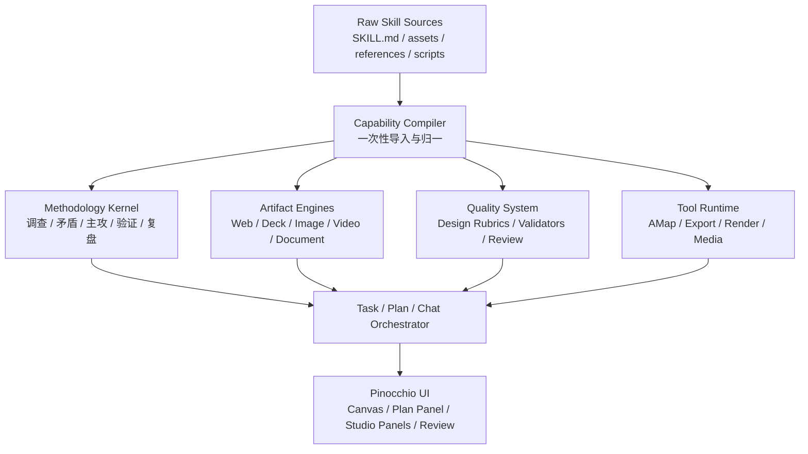

# O:\any_skills 深度融合方案 v3

> **已被 v4 取代**：最新方案见 `docs/unified-canvas-studio-skill-fusion-v4.md`。v4 明确把 Canvas 和 Artifact Studio 合并为统一的 Canvas Studio，并把数据存储重构为服务创作、渲染、导出的项目级模型。

日期：2026-05-08
目标项目：Pinocchio
来源目录：`O:\any_skills`
本版定位：纠正“拼接式 skill registry”思路，改为“能力内化式融合”

## 1. 先承认问题

上一版方案的核心问题是：它仍然把 `SKILL.md` 当成运行时可选提示词包，最多做到扫描、分类、canonical、按需注入。这更像给 Claude Code 装 skill，不是 Pinocchio 自己长出能力。

真正的融合不是“把 skill 放进系统”，而是：

| 旧思路 | 为什么不够 | 深度融合思路 |
|---|---|---|
| 扫描 `SKILL.md`，做 Skill Library | 只是把外部仓库搬进 UI | 导入阶段把 skill 编译成项目内部能力模型 |
| 用户选择 skill，PromptManager 注入正文 | 还是 prompt 拼接，模型每次重新读说明书 | 模型只收到当前阶段的短契约，流程由产品状态机驱动 |
| 同名 skill 选 canonical | 解决冲突，但没有吸收能力 | 把重合 skill 拆成 engine、preset、validator、reference，各归其位 |
| 资源目录 staging | 只是保证路径能读 | 把资源注册为主题、模板、布局、导出器、校验规则 |
| 工具型 skill 变 ToolDefinition | 只是工具注册 | 工具结果进入方法论闭环、Canvas、任务和复盘系统 |

一句话新判断：

**`O:\any_skills` 不应该作为“skill 仓库”接入，而应该作为“能力原料库”被编译进 Pinocchio 的方法论内核、Artifact 引擎、设计质量系统、媒体流水线和工具运行时。**

## 2. 深度融合的判据

| 判据 | 不满足时的表现 | 满足时的表现 |
|---|---|---|
| 是否脱离原始 prompt 运行 | 每次靠注入 `SKILL.md` 正文 | 导入后生成结构化能力，运行时不依赖整篇正文 |
| 是否有内部状态 | 模型自由发挥，无法追踪阶段 | 有 `methodologyState`、`artifactState`、`reviewState` |
| 是否有产品 UI | 只有 skill 列表和开关 | 有方法论面板、主攻锁、矛盾图、Deck Studio、Review 面板 |
| 是否有验证器 | 靠模型自称“已检查” | 有代码、HTML、PPT、视觉、方法论各自的 validator |
| 是否形成统一数据模型 | 每套 skill 自己一套说法 | 统一成 Pinocchio 的 workflow、surface、engine、preset、rubric |
| 是否处理重合能力 | 用哪个、丢哪个 | 拆开吸收：runtime、preset、rubric、reference、tool 分别归并 |
| 是否能被任务系统调度 | 用户手动挑 skill | IntentRouter / MethodologyKernel 自动产生执行图 |

## 3. 新总体架构

| 层 | 模块 | 不是做什么 | 是做什么 |
|---|---|---|---|
| 原料层 | `O:\any_skills` | 不作为运行时 prompt 仓库 | 作为导入源、审计源、资源源 |
| 编译层 | `CapabilityCompiler` | 不只提取 name/description | 抽取 trigger、workflow、output contract、assets、validators、presets |
| 方法论层 | `MethodologyKernel` | 不叫模型“按某 skill 思考” | 维护结构化任务状态和方法论步骤 |
| 产物层 | `ArtifactEngines` | 不让模型随便吐 HTML | 用 engine contract 生成、校验、预览、导出 |
| 质量层 | `QualitySystem` | 不把 critique 当一篇提示词 | 把设计、过程、可访问性、验证变成 rubric 和检查器 |
| 工具层 | `ToolRuntime` | 不让模型知道脚本怎么跑 | 暴露稳定 tools，结果进入状态和证据链 |
| UI 层 | Pinocchio | 不展示一堆 skill 名让用户选 | 展示“方法、产物、质量、导出”的产品能力 |

## 4. Skill 原料如何被“编译”

### 4.1 编译产物

| 原始内容 | 编译成 | 示例 |
|---|---|---|
| frontmatter `name/description` | `CapabilityManifest` | `deck.html_ppt.engine`、`method.investigation` |
| 触发条件 | `ActivationRule` | “信息不足时进入调查阶段” |
| 方法流程 | `WorkflowGraph` | 调查 -> 矛盾分析 -> 主攻 -> 验证 -> 复盘 |
| 输出格式 | `OutputSchema` | 调查报告 schema、矛盾表 schema、Deck IR |
| 资源目录 | `AssetBundle` | html-ppt themes/layouts/runtime、Open Design seeds |
| references | `ReferencePack` | design-system、phase guide、contradiction types |
| scripts | `RuntimeCommand` | AMap CLI、html-ppt export、HyperFrames render |
| 禁止事项 | `Guardrail` | 不得无调查下结论、不得未验证称完成 |
| self-check | `Validator` | visual checklist、layout check、methodology review |

### 4.2 导入后不再“原样使用”

| 运行阶段 | 不应该做 | 应该做 |
|---|---|---|
| Chat turn | 拼接完整 `SKILL.md` | 读取 `CapabilityActivation` 的短契约 |
| Plan generation | 让模型自由写计划 | `MethodologyKernel` 先生成 workflow graph 和 state |
| Artifact creation | 让模型从 prompt 记模板 | 从 `ArtifactEngine` 取 seed/template/runtime |
| Review | 注入 critique 文本让模型评 | 使用 `ReviewRubric` 结构化打分和问题表 |
| Export | 模型描述导出步骤 | Runtime 执行导出器，输出证据 |

## 5. Qiushi 的深度融合方式

Qiushi 不应该被做成“可选 skill”。它应该变成 Pinocchio 的方法论内核。

### 5.1 产品化后的名字

| Qiushi 源能力 | 产品内生能力名 | 用户看到什么 |
|---|---|---|
| `arming-thought` | `MethodologyKernel` | “事实优先 / 验证优先”基础纪律 |
| `investigation-first` | `InvestigationStage` | 调查提纲、事实表、未知项 |
| `contradiction-analysis` | `ContradictionMap` | 主要矛盾、次要矛盾、转化风险 |
| `concentrate-forces` | `FocusLock` | 主攻目标、暂缓队列、完成信号 |
| `practice-cognition` | `ValidationLoop` | 假说、验证动作、结果、下一轮 |
| `mass-line` | `FeedbackLoop` | 多源反馈、一致点、冲突点、缺口 |
| `criticism-self-criticism` | `ReviewReport` | 问题分级、根因、改进建议 |
| `protracted-strategy` | `PhaseStrategy` | 探索、防御/相持/反攻式阶段判断 |
| `spark-prairie-fire` | `FootholdStrategy` | MVP 根据地、三步扩展路线 |
| `overall-planning` | `BalanceMap` | 多目标关系、平衡点、失衡预警 |
| `workflows` | `WorkflowTemplates` | 新项目启动、复杂问题攻坚、方案迭代优化 |

### 5.2 内部数据模型

| 类型 | 字段 | 来源 | 用途 |
|---|---|---|---|
| `MethodologyState` | `workflowType`、`phase`、`activeStage`、`primaryFocus` | `workflows`、`protracted-strategy`、`concentrate-forces` | 每个任务的总状态 |
| `EvidenceItem` | `source`、`fact`、`confidence`、`unknown` | `investigation-first` | 防止无事实判断 |
| `ContradictionItem` | `a`、`b`、`nature`、`rank`、`dominantSide`、`risk` | `contradiction-analysis` | 决定主攻方向 |
| `FocusLock` | `target`、`reason`、`doneSignal`、`pausedItems` | `concentrate-forces` | 防止任务发散 |
| `ValidationCycle` | `hypothesis`、`action`、`expected`、`actual`、`learning` | `practice-cognition` | 验证闭环 |
| `FeedbackSynthesis` | `sources`、`agreements`、`conflicts`、`gaps` | `mass-line` | 多源反馈整合 |
| `ReviewFinding` | `severity`、`specificIssue`、`rootCause`、`fix` | `criticism-self-criticism` | 结构化复盘 |
| `PhaseAssessment` | `stage`、`advantages`、`weaknesses`、`transitionCondition` | `protracted-strategy` | 长期计划 |
| `FootholdPlan` | `base`、`proof`、`expansionSteps`、`antiScatterCheck` | `spark-prairie-fire` | MVP 路线 |
| `BalanceRelation` | `left`、`right`、`currentBias`、`minimumGuarantee`、`warning` | `overall-planning` | 多目标取舍 |

### 5.3 对当前项目的具体改造

| 当前文件 | 当前状态 | 深度融合改造 |
|---|---|---|
| `packages/core/src/methodology/coreDisciplines.ts` | 几条静态纪律 | 改成 `MethodologyKernel` 的轻量常驻规则 |
| `packages/core/src/methodology/workflow.ts` | 3 个 workflow、3 个 phase 的关键词判断 | 改成 workflow graph，节点来自 Qiushi workflows |
| `packages/core/src/methodology/priorityMatrix.ts` | 简单关键词打分 | 改为 `FocusLockService`，输出主攻、暂缓、完成信号 |
| `packages/core/src/tools/methodologyTools.ts` | 多个占位工具 | 改为真实结构化 tools：investigate、map_contradictions、lock_focus、record_validation、review_work |
| `packages/core/src/methodology/autoReview.ts` | 固定复盘模板 | 改成 `ReviewEngine`，使用 Qiushi review schema |
| `packages/core/src/methodology/multiPassCoordinator.ts` | 固定角色摘要 | 改为基于 workflow graph 的执行器 |
| `packages/core/src/core/intentRouter.ts` | 识别 canvas、coding、research 等 flags | 增加 methodology intent：needsInvestigation、needsContradictionMap、needsFocusLock |
| `apps/web/components/workbench/PlanMethodologyControls.tsx` | 计划类型/阶段/主攻的轻控件 | 升级成 Methodology Panel，可编辑矛盾图、主攻锁、验证循环 |
| `packages/shared/src/capability.ts` | capability flags | 增加 methodology schema，不只 boolean flags |

### 5.4 Qiushi 不应该怎么融合

| 错误做法 | 原因 |
|---|---|
| UI 里显示 11 个 Qiushi skill 让用户选 | 这是安装 skill，不是产品化 |
| 每次 plan 都注入完整 Qiushi 正文 | 浪费上下文，也会形式化 |
| 保留政治化语汇作为模型工具名 | 没必要，且会干扰通用产品语义 |
| 把 Qiushi 只用于写作或研究 | 低估了它的任务推进价值 |
| 把 `workflows` 当文档参考 | 它应该直接变成 workflow graph |

## 6. Open Design 的深度融合方式

Open Design 不是“很多网页 skill”。它应被吸收为 Artifact Studio 的素材和 recipe 系统。

| Open Design 原料 | 编译后产品能力 | 内部模块 |
|---|---|---|
| `web-prototype`、`dashboard`、`pricing-page` | Web Artifact recipes | `PrototypeEngine` |
| `mobile-app`、`mobile-onboarding` | Mobile mock/app recipes | `MobilePrototypeEngine` |
| `html-ppt-*` deck presets | Deck presets | `DeckEngine.presets` |
| `design-brief` | Design brief parser / design system generator | `DesignSystemEngine` |
| `critique` | Artifact review rubric | `ReviewEngine.rubrics.artifact` |
| `tweaks` | Parametric variant controls | `VariantEngine` |
| `orbit-*` | Connector UI templates | `ConnectorArtifactEngine` |
| `image-poster`、`social-carousel` | Image/social artifact recipes | `ImageArtifactEngine` |
| `hyperframes` | OD-to-HyperFrames bridge | `VideoEngine.openDesignAdapter` |

### 6.1 PrototypeEngine

| 输入 | 处理 | 输出 |
|---|---|---|
| 用户 brief | MethodologyKernel 先判断目标、约束、主攻 | `PrototypeSpec` |
| `design-brief` | 生成 design tokens、视觉原则 | `DesignSystem` |
| Open Design seed/templates | 注入布局 recipe，不注入整篇 skill | `AppHtmlProject` |
| taste/impeccable rubrics | 自检视觉质量 | `ReviewReport` |
| Canvas renderer | 受控预览 | 可交互 HTML Canvas |

### 6.2 Open Design 不再作为 skill 列表展示

| 旧展示 | 新展示 |
|---|---|
| `web-prototype` skill | “创建网页原型” |
| `dashboard` skill | “创建仪表盘” |
| `pricing-page` skill | “页面类型：定价页” |
| `html-ppt-product-launch` skill | “Deck 模板：产品发布” |
| `web-prototype-taste-soft` skill | “视觉风格：Soft Premium” |
| `tweaks` skill | “变体面板：强调色 / 字号 / 密度 / 圆角” |

## 7. html-ppt 的深度融合方式

html-ppt 不应该只是一个可选 prompt。它应该成为独立 Deck Engine。

| 组成 | 来源 | 产品化结果 |
|---|---|---|
| Runtime | html-ppt `assets/runtime.js` | `DeckRuntime` |
| Theme catalog | html-ppt `assets/themes/*.css` | Deck 主题选择器 |
| Layout catalog | html-ppt templates/references | Slide layout picker |
| Animation catalog | html-ppt CSS/canvas FX | 动画面板 |
| Presenter mode | html-ppt presenter docs/runtime | 演讲者模式 UI |
| Open Design deck skills | `html-ppt-*` | Deck presets |
| `ckm:slides` | Chart.js/copywriting | Chart slide helpers |
| `pptx-html-fidelity-audit` | PPTX audit | Export validator |

### 7.1 DeckEngine 内部模型

| 类型 | 字段 | 用途 |
|---|---|---|
| `DeckSpec` | `title`、`audience`、`purpose`、`format`、`themeId` | deck 总规格 |
| `SlideSpec` | `layoutId`、`contentBlocks`、`notes`、`animation` | 单页结构 |
| `DeckTheme` | `cssPath`、`tokens`、`preview` | 主题系统 |
| `DeckRuntimeConfig` | `keyboard`、`presenterMode`、`fx` | 运行时能力 |
| `DeckExportJob` | `format`、`viewport`、`pages` | PNG/PDF/PPTX 导出 |
| `DeckAuditResult` | `overflow`、`footerDrift`、`missingStyle` | 导出一致性校验 |

### 7.2 用户体验

| 用户意图 | 系统动作 |
|---|---|
| “做一份 PPT” | 进入 Deck Studio，不是普通 Canvas 文档 |
| “技术分享” | 选 `tech-sharing` preset，自动打开 presenter notes |
| “小红书图文” | 选 3:4 carousel deck format |
| “导出 PPTX” | 走 export job + fidelity audit |

## 8. HyperFrames 的深度融合方式

HyperFrames 不应该塞进普通 HTML artifact。它应该是 Video Workspace。

| 原料 | 产品化结果 |
|---|---|
| `hyperframes` | `VideoCompositionEngine` |
| `hyperframes-cli` | Render / preview / inspect job runner |
| `hyperframes-media` | TTS、transcribe、remove-background media tasks |
| GSAP/WAAPI/CSS/Anime/Lottie/Three adapter skills | Motion adapter registry |
| `website-to-hyperframes` | Website capture -> script -> storyboard -> composition pipeline |
| Open Design `video-shortform` | Shortform recipe |
| Open Design `hyperframes` | OD scaffold adapter |

| 内部类型 | 说明 |
|---|---|
| `VideoSpec` | 目标平台、时长、节奏、旁白、视觉风格 |
| `Storyboard` | 场景、镜头、转场、文案、时间 |
| `CompositionWorkspace` | `hyperframes.json`、`index.html`、assets |
| `MediaJob` | TTS、转写、去背景、截图捕获 |
| `RenderJob` | preview、inspect、render |
| `MotionContract` | seek-safe 动画约束 |

## 9. taste / impeccable / ui-ux 的深度融合方式

这些不应该互相抢“设计 skill”入口，而应该拆成三个系统：风格生成、质量审查、设计 token。

| 来源 | 深度融合位置 | 说明 |
|---|---|---|
| taste `imagegen-frontend-web/mobile` | `ImageDirectionEngine` | 生成 section-level 设计参考图 |
| taste `image-to-code` | `ImageToPrototypePipeline` | 图像 -> 分析 -> PrototypeSpec -> 实现 |
| taste `brandkit` | `BrandSystemEngine` | logo、品牌板、identity deck |
| taste style skills | `StylePresetRegistry` | minimalist、brutalist、soft premium 等风格 |
| impeccable | `DesignReviewEngine` | UI polish、hierarchy、accessibility、interaction、responsive |
| Open Design `critique` | `ArtifactReviewRubric` | 5 维度 artifact 评审 |
| `ui-ux-pro-max` | `DesignReferenceDB` | palettes、font pairs、UX rules、charts |
| `ckm:design-system` | `TokenEngine` | primitive/semantic/component token |
| `ckm:ui-styling` | `FrontendComponentGuidelines` | shadcn/Tailwind 实现参考 |

### 9.1 ReviewEngine 统一分工

| 评审维度 | 来源 | 输出 |
|---|---|---|
| 方法论过程 | Qiushi `criticism-self-criticism` | 是否调查、抓主矛盾、验证、复盘 |
| UI 质量 | impeccable | 层级、间距、字体、颜色、响应式、状态 |
| Artifact 完整性 | Open Design `critique` | 哲学一致性、视觉层级、功能性、可复用性 |
| Web 基础规范 | `web-design-guidelines`、`ckm:ui-styling` | accessibility、shadcn/Tailwind、交互控件 |
| 风格高级感 | taste | anti-slop、图像使用、布局变化、motion |

## 10. AMap 的深度融合方式

AMap 是工具，不是 prompt。

| 原料 | 深度融合 |
|---|---|
| `references/command-map.md` | 生成 tool schema 映射 |
| `scripts/` | 封装为 core service |
| `AMAP_MAPS_API_KEY` | env 配置和 Settings UI |
| geocode / route / weather / POI | 多个稳定 `ToolDefinition` |

| Tool | 输入 | 输出 |
|---|---|---|
| `amap_geocode` | address、city | location、formatted address、confidence |
| `amap_regeocode` | lng、lat | address components |
| `amap_weather` | city/adcode | live / forecast |
| `amap_route` | origin、destination、mode | route summary、steps、distance、duration |
| `amap_poi_search` | keyword、city、types | POI list |
| `amap_distance` | origins、destination、mode | distances |

工具结果进入 `EvidenceItem`，而不是只返回给模型自由解释。

## 11. skills-main 和 Khazix 的深度融合方式

### 11.1 工程栈 skills

| 来源 | 深度融合 |
|---|---|
| `pnpm` | PackageManagerPolicy，约束依赖安装、workspace 命令 |
| `vitest` | TestRunnerPolicy，生成和运行测试建议 |
| `turborepo` | MonorepoTaskPolicy，未来如果引入 turbo 再启用 |
| `vite` / `tsdown` | BuildPolicy，按项目类型启用 |
| Vue/Nuxt/Pinia | Stack-specific capability，默认禁用 |

这些不需要暴露给普通用户。它们应当在 Coding mode 中作为工程策略，不是用户可选 skill。

### 11.2 Khazix

| 来源 | 深度融合 |
|---|---|
| `hv-analysis` | ResearchLens：横向对比 + 纵向演化 |
| `neat-freak` | KnowledgeBaseOrganizer：知识库整理和变更影响矩阵 |
| `khazix-writer` | WritingPersona：显式选择的公众号长文风格 |

Khazix 不应默认进入写作，因为 persona 太强；但 `hv-analysis` 和 `neat-freak` 可以进入研究和知识库治理。

## 12. 重合能力的真正处理方式

“用哪个、丢哪个”不应该只按 skill 粒度。深度融合要按能力部件拆。

| 重合组 | 不再这样处理 | 改成这样处理 |
|---|---|---|
| Qiushi vs 现有 methodology | 保留两个方法论 prompt | Qiushi schema 吸收进现有 methodology 模块，替换薄弱实现 |
| html-ppt vs Open Design deck | 选一个 canonical | html-ppt 做 runtime，Open Design 做 presets，ckm:slides 做 chart/copy reference |
| impeccable vs critique vs taste | 选一个 UI review skill | 合成 ReviewEngine，不同来源负责不同 rubric |
| taste vs ui-ux-pro-max | 选一个设计库 | taste 做风格与图像方向，ui-ux-pro-max 做 reference DB |
| HyperFrames main vs Open Design hyperframes | 选一个 | main 做 engine，Open Design 做 scaffold adapter |
| AMap prompt vs scripts | 把 prompt 注入模型 | scripts 封装为 ToolDefinition，结果入证据链 |
| Vue skills vs 当前 Next 项目 | 全部导入 | 作为 stack-specific disabled capability |

## 13. 运行时流程

### 13.1 普通复杂任务

| 步骤 | 模块 | 行为 |
|---|---|---|
| 1 | `IntentRouter` | 判断是否需要调查、计划、Canvas、工具、设计、视频 |
| 2 | `MethodologyKernel` | 生成 `MethodologyState`，决定 workflow 和当前阶段 |
| 3 | `EvidenceCollector` | 需要时调用文件、web、AMap、代码运行等工具 |
| 4 | `ContradictionMapper` | 生成主要矛盾和主攻方向 |
| 5 | `CapabilityPlanner` | 选择 ArtifactEngine / ToolRuntime / ReviewEngine |
| 6 | `ArtifactEngine` | 生成结构化产物，不是自由文本 |
| 7 | `Validator` | 执行 HTML/PPT/code/design/methodology 校验 |
| 8 | `ReviewEngine` | 生成复盘和改进建议 |
| 9 | UI | 展示结果、证据、主攻锁、可调整项 |

### 13.2 Web 原型任务

| 阶段 | 不再依赖 | 内生能力 |
|---|---|---|
| 需求理解 | `web-prototype` 整文 prompt | `PrototypeSpec` |
| 视觉方向 | taste 整文 prompt | `DesignSystemEngine` + `StylePresetRegistry` |
| HTML 生成 | 模型自由写 | `PrototypeEngine` seed + layout recipe |
| 自检 | 模型口头检查 | `DesignReviewEngine` + DOM/viewport checks |
| 微调 | 重新 prompt | `VariantEngine` 控制 accent、density、scale |

### 13.3 PPT 任务

| 阶段 | 内生能力 |
|---|---|
| 需求 | `DeckSpec` |
| 模板 | `DeckPresetRegistry` |
| 页面结构 | `SlideSpec[]` |
| 运行 | `DeckRuntime` |
| 演讲者模式 | `PresenterMode` |
| 导出 | `DeckExportJob` |
| 审计 | `DeckAuditResult` |

## 14. UI 应该怎么变

| 当前 UI | 深度融合后的 UI |
|---|---|
| Composer 工具按钮 | 增加“方法论状态”提示，而不是 skill 选择器为主 |
| PlanMethodologyControls | 升级为 Methodology Panel |
| Canvas | 按 engine 展示：Document / Prototype / Deck / Video / Image |
| Skill Library | 退居 “Sources / Capabilities” 管理页 |
| Review | 增加 Review 面板，展示方法论、UI、artifact、验证四类问题 |
| Settings | 增加 engines、tools、asset packs、experimental media 配置 |

### 14.1 Methodology Panel

| UI 区域 | 内容 |
|---|---|
| Workflow | 新项目启动 / 复杂问题攻坚 / 方案迭代优化 |
| Phase | 探索积累 / 攻坚推进 / 全面展开 |
| Evidence | 已确认事实、合理推断、存疑事项 |
| Contradictions | 主要矛盾、次要矛盾、性质、转化风险 |
| Focus Lock | 当前主攻目标、暂缓项、完成信号 |
| Validation | 假说、验证动作、结果、下一轮 |
| Review | 问题表、根因、改进建议 |

### 14.2 Artifact Studio

| Studio | 吸收的 skill 来源 | 功能 |
|---|---|---|
| Prototype Studio | Open Design、taste、impeccable | 网页、dashboard、mobile app 原型 |
| Deck Studio | html-ppt、Open Design deck、ckm slides | PPT、讲稿、小红书图文、导出 |
| Brand Studio | taste brandkit、ckm brand/design | logo、品牌板、视觉系统 |
| Video Studio | HyperFrames、Open Design video | 短视频、网站转视频、字幕、渲染 |
| Tool Studio | AMap | 地图查询、路线、天气、POI |

## 15. 存储和数据表建议

| 数据 | 存储 | 说明 |
|---|---|---|
| `capability_sources` | SQLite | 原始 skill 文件路径、hash、suite、line count |
| `compiled_capabilities` | SQLite / JSON | 编译后的能力 manifest |
| `asset_bundles` | 文件 + metadata | themes、templates、runtime、examples |
| `methodology_states` | SQLite | 每个 conversation/task 的方法论状态 |
| `review_reports` | SQLite | 过程、UI、artifact、验证复盘 |
| `artifact_projects` | SQLite + workspace files | Prototype/Deck/Video workspace |
| `runtime_jobs` | SQLite | export/render/media/tool jobs |

## 16. 新落地路线

| 阶段 | 目标 | 交付物 | 验收标准 |
|---|---|---|---|
| Phase 0 | Capability Compiler | 扫描、hash、结构抽取、能力归一 | 153 个源文件变成 compiled manifests |
| Phase 1 | MethodologyKernel | Qiushi 内化为 schema、state、workflow graph | Plan 输出不靠拼接 prompt，能生成结构化调查/矛盾/主攻/验证/复盘 |
| Phase 2 | ReviewEngine | Qiushi + impeccable + critique + taste rubrics 合并 | Canvas/Plan 有统一 review report |
| Phase 3 | PrototypeEngine | Open Design web/dashboard/mobile recipes 产品化 | 能生成可预览、可微调、可审查的 HTML prototype |
| Phase 4 | DeckEngine | html-ppt runtime + OD presets + export audit | PPT Canvas 有主题、模板、speaker notes、导出验证 |
| Phase 5 | ToolRuntime AMap | AMap tools + evidence integration | 地图结果能进入事实表和回答引用 |
| Phase 6 | Brand/Image Engine | taste imagegen/brandkit + Open Design image recipes | 设计图和品牌资产有独立流程 |
| Phase 7 | VideoEngine | HyperFrames workspace + render jobs | 视频可预览、inspect、render |
| Phase 8 | Source Management UI | Sources/Capabilities 管理页 | 用户能看来源，但日常不需要手选 skill |

## 17. 第一版 MVP 重新定义

上一版 MVP 是 Registry + active skill。现在改掉。

| 顺序 | MVP 任务 | 为什么这才算融合 |
|---:|---|---|
| 1 | `CapabilityCompiler` 生成 compiled manifests | skill 从文本变成内部能力数据 |
| 2 | `MethodologyKernel` 替换现有 methodology 薄实现 | Qiushi 变成任务状态机，不是 prompt |
| 3 | `ReviewEngine` 合并自我批评、UI polish、artifact critique | 多套重合 review 变成一个产品能力 |
| 4 | `PrototypeEngine` 接 Open Design seed 和 taste style preset | web skills 变成 Artifact Studio |
| 5 | `DeckEngine` 接 html-ppt runtime 和 OD presets | PPT skill 变成专用引擎 |
| 6 | UI 改造 Methodology Panel + Prototype/Deck Studio 入口 | 用户看到的是产品能力，不是 skill 清单 |

## 18. v3 结论

| 问题 | v3 答案 |
|---|---|
| 还要不要 Skill Registry | 要，但只作为 source/capability 管理，不是核心体验 |
| 还要不要 active skill | 可以有，但不是主路径；主路径是 engine 和 methodology state |
| Qiushi 怎么用 | 做成 MethodologyKernel，优先落地 |
| Open Design 怎么用 | 做成 Prototype/Deck/Image recipes，不展示为一堆 skill |
| html-ppt 怎么用 | 做成 DeckEngine |
| HyperFrames 怎么用 | 做成 VideoEngine |
| taste/impeccable 怎么用 | 做成 DesignQualitySystem |
| AMap 怎么用 | 做成 ToolRuntime |

最终目标不是“Pinocchio 能使用这些 skills”，而是：

**Pinocchio 吸收这些 skills 以后，自己变成一个有方法论、有产物引擎、有质量闭环、有工具证据链的工作台。**
