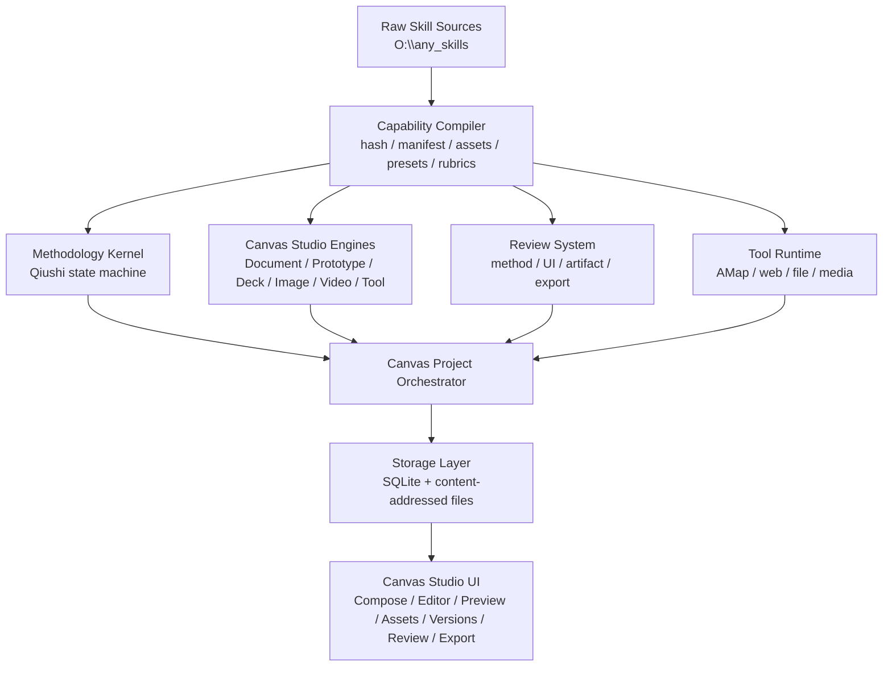

# Unified Canvas Studio 与 Skill 分层深度融合方案 v4

日期：2026-05-08
目标项目：Pinocchio
来源目录：`O:\any_skills`
本版定位：替代 `docs/skill-deep-fusion-v3.md`，把 Canvas 与 Artifact Studio 统一为一个产品能力，并重新设计面向创作、渲染、导出的数据底座。

## 0. 先纠正 v3 的不足

v3 已经从“安装 skill”推进到“能力内化”，但它仍然保留了一个隐含错误：把 Canvas 和 Artifact Studio 当成两个可以并列存在的东西。这个方向还不够深。

| 问题 | v3 的残留倾向 | v4 的修正 |
|---|---|---|
| 产品主面 | Canvas 是一个展示区，Artifact Studio 是一组产物引擎 | 统一为 `Canvas Studio`，它既是创作面、预览面、编辑面，也是渲染和导出的项目容器 |
| Artifact 定位 | Artifact Engines 仍像一组独立产物系统 | Artifact 退为 legacy 兼容层、外部输出格式、导出结果，不再是一级创作对象 |
| 数据模型 | 提到 `artifact_projects`，但没有重构当前 `canvases` 单表模型 | 建立 `canvas_projects`、版本、资产、文件、渲染、导出、审查、方法论状态的统一模型 |
| skill 融合 | 分到 Methodology / Artifact / Review / Tool | 再往下沉：skill 先编译为能力层，再服务 Canvas Studio 的项目生命周期 |
| 存储策略 | SQLite + workspace files 只是提了一句 | 明确 SQLite 与文件/对象存储的边界，避免未来视频、图片、HTML bundle、PDF、PPTX 被错误塞入数据库 |

一句话判断：

**Pinocchio 的产品定位不是“聊天窗口旁边放一个 artifact 预览器”，而是“以对话为调度入口、以 Canvas Studio 为统一工作面、以方法论和引擎层为内核的 AI 创作与执行工作台”。**

## 1. 当前仓库事实

| 位置 | 当前事实 | 对 v4 的含义 |
|---|---|---|
| `packages/shared/src/canvas.ts` | `CanvasKind = document / code / app / diagram / chart / ppt`，内容为 `contentJson`、`contentText`、`metadata` | 适合文档和轻量预览，不足以承载完整项目、资产、渲染和导出 |
| `packages/shared/src/artifact.ts` | `ArtifactType = markdown / html / code / report / newspaper`，内容是单个 `content` 字符串 | Artifact 是旧式“单文件产物”，不适合作为未来主模型 |
| `packages/core/src/storage/sqliteSchema.ts` | SQLite 有 `canvases`、`plans`、`plan_steps`、`cards`，Canvas 是单表 | 缺少项目、版本、资产、文件、任务、输出、审查、方法论状态表 |
| `packages/core/src/canvas/canvasRevisionStore.ts` | Canvas revisions 仍写入 JSON：`canvases/revisions.json` | 版本历史还没有进入可查询、可迁移、可关联的数据库模型 |
| `packages/core/src/core/artifactManager.ts` | Artifact 仍存 JSON：`artifacts/artifacts.json`，HTML 会 sanitize | Artifact 与 Canvas 存储割裂，后续应迁移为 Canvas legacy adapter |
| `packages/core/src/canvas/legacyArtifactCanvas.ts` | 已经把 legacy Artifact 转成 Canvas | 这是统一方向的证据，应继续推进，不应再新增独立 Artifact Studio |
| `apps/web/app/api/canvases/route.ts` | Canvas 列表会合并 legacy artifact canvas | UI 层已经开始把两者合并展示 |
| `packages/core/src/canvas/canvasExport.ts` | 服务端只支持 `json / markdown / html / docx` | 未来 PDF、PNG、PPTX、MP4、asset bundle 需要 job/output 模型 |
| `apps/web/app/api/canvases/[id]/export/route.ts` | `pdf / png` 被拒绝，提示 browser-only | 渲染/导出不能继续靠同步 API 字符串返回 |
| `apps/web/components/workbench/CanvasRenderer.tsx` | 支持 block AST、`codeProject` iframe、Mermaid、Vega、`embedHtml` | 这是预览层雏形，但不是项目工作区和导出流水线 |
| `apps/web/components/workbench/PptCanvasViewer.tsx` | 按 heading/divider 拆页 | 这不是 Deck Engine，只是文档切片式 PPT viewer |

结论：仓库已经在朝“Artifact 合并到 Canvas”走，但数据模型和引擎边界还没跟上。

## 2. 产品定位

| 层面 | 定位 |
|---|---|
| 用户心智 | “我在一个 AI 工作台里做东西”，不是“我让模型吐一个 artifact” |
| 核心对象 | `Canvas Project`，不是 `Artifact`，也不只是 `CanvasDocument` |
| 对话角色 | Chat 是需求澄清、方法论调度、任务推进入口 |
| Canvas 角色 | Canvas Studio 是创作、编辑、预览、审查、版本、资产、渲染、导出的统一空间 |
| Skill 角色 | `O:\any_skills` 是能力原料库，编译成项目内部的方法、引擎、模板、校验器、工具 |
| Qiushi 角色 | 方法论内核，是思想武器层，不是用户手动挑选的 prompt 包 |
| 输出角色 | Artifact 是 Canvas Project 的一次输出、分享格式或 legacy 兼容层 |

## 3. 统一 Canvas Studio

### 3.1 命名和对象关系

| 名称 | 是否保留 | v4 定义 |
|---|---|---|
| Canvas | 保留，但升级 | 用户看到的统一工作面，可以承载文档、网页、App、Deck、图片、视频、工具结果 |
| Canvas Studio | 新增主概念 | Canvas 的编辑、预览、审查、资产、渲染、导出一体化产品面 |
| Canvas Project | 新增核心数据对象 | 一个可版本化、可渲染、可导出的创作项目 |
| Canvas Document | 保留为子类型 | 文档型项目的主要内容节点 |
| Artifact | 降级 | legacy 输入、导出输出、外部格式，不再是独立 Studio |
| Artifact Studio | 不单独保留 | 并入 Canvas Studio 的 engine 面板 |

### 3.2 统一后的用户路径

| 用户意图 | 旧路径 | 新路径 |
|---|---|---|
| 写一篇技术方案 | Chat 生成 Markdown Artifact 或 Canvas 文档 | 创建 `Canvas Project(kind=document)`，进入 Document Engine |
| 做一个 HTML 原型 | 创建 html Artifact，在右侧 iframe 预览 | 创建 `Canvas Project(kind=prototype)`，进入 Prototype Engine，带文件树、资产、审查、导出 |
| 做 PPT | Canvas kind `ppt`，按 heading 切片 | 创建 `Canvas Project(kind=deck)`，进入 Deck Engine，使用 html-ppt runtime 和 presets |
| 做小红书图文 | 可能是 PPT 或 image artifact | 创建 `Canvas Project(kind=deck/social)` 或 `kind=image_set`，共用资产和导出任务 |
| 做视频 | 现在没有主路径 | 创建 `Canvas Project(kind=video)`，进入 HyperFrames workspace，走 render job |
| 导出 PDF/PNG/PPTX/MP4 | 同步 API 或浏览器临时处理 | 创建 `export_jobs` / `render_jobs`，结果进入 `canvas_outputs` |
| 评审设计 | 独立 critique artifact | 对 Canvas Project 的某个 version 生成 `review_report` |

### 3.3 Studio 内部视图

| 视图 | 面向对象 | 功能 |
|---|---|---|
| Compose | 用户、模型、MethodologyKernel | 需求、事实、矛盾、主攻目标、任务推进 |
| Outline | Canvas Project | 文档结构、页面结构、场景结构、slide 结构 |
| Editor | Canvas Project / files / nodes | 结构化编辑、局部改写、代码/HTML/Deck 文件编辑 |
| Preview | render target | iframe、document、deck、chart、video preview |
| Assets | `canvas_assets` | 图片、音频、字体、模板、截图、生成物 |
| Versions | `canvas_versions` | 快照、diff、restore、branch |
| Review | `review_reports` | 方法论、视觉、交互、导出一致性、可访问性审查 |
| Export | `export_jobs` / `canvas_outputs` | PDF、PNG、HTML bundle、PPTX、DOCX、MP4、ZIP |

## 4. 存储选择

### 4.1 三种方案比较

| 方案 | 优点 | 致命问题 | 结论 |
|---|---|---|---|
| 全部放 SQLite | 事务简单、查询方便、备份单文件 | 大文件、视频、图片、HTML bundle、渲染中间产物会撑爆 DB；base64 会浪费空间；并发渲染写入不优雅 | 不采用 |
| 全部放文件系统 | 大文件自然、接近项目 workspace | 查询、关联、版本、状态机、迁移、跨 conversation 索引会混乱 | 不采用 |
| SQLite + 内容寻址文件/对象存储 | 元数据可查询，二进制和 bundle 可流式存储，未来可迁移对象存储 | 需要定义清晰边界和 GC 规则 | 采用 |

推荐策略：

**SQLite 存“关系、状态、索引、版本、作业、审查和小型 JSON”；文件/对象存储存“大内容、资产、workspace 文件、render/export 输出”。**

### 4.2 SQLite 与文件存储边界

| 数据 | 放 SQLite | 放文件/对象存储 | 理由 |
|---|---|---|---|
| Project metadata | 是 | 否 | 需要按 conversation、kind、更新时间、状态查询 |
| Canvas IR 小型 JSON | 是 | 可选快照 | 方便 diff、回滚、模型上下文读取 |
| 版本索引 | 是 | 版本大包可放文件 | 版本要可查询、可恢复 |
| HTML/CSS/JS workspace | 存文件索引 | 是 | 代码文件需要原样编辑、打包、渲染 |
| 图片、音频、视频、字体 | 存 hash、mime、尺寸、用途 | 是 | 禁止 base64 常驻 DB |
| 渲染输出 PNG/PDF/MP4 | 存 output 记录 | 是 | 输出可能很大，且可重新生成 |
| 导出 ZIP/PPTX/DOCX | 存 output 记录 | 是 | 二进制文件，不适合 DB |
| Tool result 小 JSON | 是 | 大响应落文件 | 可进入证据链 |
| Review report | 摘要和结构化问题 | HTML/截图可落文件 | 报告要可检索，附件要可查看 |
| Skill source inventory | 是 | 原始 skill 文件仍在源目录 | 需要 hash、路径、编译 manifest |

### 4.3 推荐文件布局

```text
.data/
  workbench.db
  canvas/
    projects/
      <projectId>/
        workspace/
          index.html
          styles.css
          src/
          hyperframes.json
        snapshots/
          <versionId>.json
        previews/
          <renderJobId>/
  assets/
    sha256/
      ab/
        abcdef...original.png
  outputs/
    <projectId>/
      renders/
        <renderJobId>/frame-0001.png
        <renderJobId>/output.mp4
      exports/
        <exportJobId>/deck.pdf
        <exportJobId>/slides.pptx
        <exportJobId>/bundle.zip
  capability/
    compiled/
      <capabilityId>.json
```

### 4.4 内容寻址资产规则

| 规则 | 说明 |
|---|---|
| `asset_hash = sha256(bytes)` | 去重、缓存、可校验 |
| `canvas_assets` 只保存 metadata | 包括 hash、mime、size、width、height、duration、origin、license、created_by |
| 同一文件多处使用只建引用 | 不复制 bytes |
| workspace 文件可引用 asset hash | HTML/Deck/Video 可以通过 resolver 映射到可访问 URL |
| render/export 输出也登记为 asset/output | 输出可追踪、可复用、可删除 |
| GC 必须基于引用计数和保留策略 | 未引用临时资产可清理，版本引用资产不能误删 |

## 5. v4 数据模型

### 5.1 核心表

| 表 | 作用 | 关键字段 | 说明 |
|---|---|---|---|
| `canvas_projects` | Canvas Studio 的一级对象 | `id`、`conversation_id`、`kind`、`engine`、`title`、`status`、`current_version_id`、`metadata` | 替代当前单表 `canvases` 的中心地位 |
| `canvas_nodes` | 结构化内容图 | `id`、`project_id`、`parent_id`、`node_type`、`order_index`、`content_json`、`text` | 文档 block、slide、scene、component 都可建模 |
| `canvas_files` | 项目 workspace 文件索引 | `id`、`project_id`、`path`、`role`、`content_hash`、`text_content`、`updated_at` | HTML/CSS/JS/HyperFrames 项目文件 |
| `canvas_versions` | 版本快照 | `id`、`project_id`、`version_number`、`reason`、`snapshot_json`、`created_by` | 取代 JSON revisions |
| `canvas_assets` | 项目资产引用 | `id`、`project_id`、`asset_hash`、`role`、`name`、`metadata` | 项目内引用，不直接存 bytes |
| `asset_blobs` | 全局内容寻址资产索引 | `hash`、`mime`、`bytes`、`storage_uri`、`created_at` | 可迁移到对象存储 |
| `render_jobs` | 预览/渲染任务 | `id`、`project_id`、`version_id`、`engine`、`status`、`input_json`、`error` | Deck PNG、Video MP4、HTML screenshot |
| `export_jobs` | 导出任务 | `id`、`project_id`、`version_id`、`format`、`status`、`options_json`、`error` | PDF、PPTX、DOCX、ZIP、MP4 |
| `canvas_outputs` | 渲染/导出结果 | `id`、`project_id`、`job_id`、`output_type`、`asset_hash`、`storage_uri`、`metadata` | 所有可下载结果 |
| `review_reports` | 审查报告 | `id`、`project_id`、`version_id`、`scope`、`score_json`、`findings_json` | 方法论、UI、导出一致性统一记录 |

### 5.2 方法论与证据表

| 表 | 作用 | 来源 skill | 关键字段 |
|---|---|---|---|
| `methodology_states` | 每个 conversation / project / plan 的方法论状态 | Qiushi `workflows`、`protracted-strategy` | `workflow_type`、`phase`、`primary_focus`、`state_json` |
| `evidence_items` | 事实、推断、未知项 | `investigation-first`、AMap、web/file tools | `source_type`、`claim`、`confidence`、`citation`、`project_id` |
| `contradiction_items` | 矛盾图 | `contradiction-analysis` | `subject_a`、`subject_b`、`nature`、`rank`、`dominant_side` |
| `focus_locks` | 主攻目标和暂缓项 | `concentrate-forces` | `target`、`done_signal`、`paused_items_json` |
| `validation_cycles` | 实践验证闭环 | `practice-cognition` | `hypothesis`、`action`、`expected`、`actual`、`learning` |
| `feedback_syntheses` | 多源反馈综合 | `mass-line` | `sources_json`、`agreements_json`、`conflicts_json`、`gaps_json` |

### 5.3 能力编译表

| 表 | 作用 | 字段 |
|---|---|---|
| `capability_sources` | 原始 skill 文件清单 | `id`、`suite`、`name`、`path`、`hash`、`line_count`、`mtime` |
| `capability_manifests` | 编译后的能力定义 | `id`、`source_id`、`layer`、`capability_type`、`activation_rule`、`contract_json` |
| `capability_assets` | skill 附带资源 | `id`、`capability_id`、`asset_type`、`path`、`hash`、`role` |
| `capability_presets` | 模板、风格、场景 preset | `id`、`capability_id`、`engine`、`preset_key`、`preset_json` |
| `capability_rubrics` | 审查规则 | `id`、`capability_id`、`scope`、`rubric_json` |

## 6. Engine Contract

Canvas Studio 不应该让模型“随便吐一个 HTML/Markdown 字符串”。每类创作都要落到 engine contract。

| Engine | 输入 IR | Workspace | Preview | Render | Export |
|---|---|---|---|---|---|
| Document Engine | `DocumentSpec`、block AST | 可无文件 | Markdown/HTML reader | HTML/PDF page render | Markdown、HTML、DOCX、PDF |
| Prototype Engine | `PrototypeSpec`、DesignSystem | `index.html`、CSS、assets | iframe sandbox | screenshot、HTML bundle | HTML ZIP、PNG、PDF |
| Deck Engine | `DeckSpec`、`SlideSpec[]` | html-ppt template files | keyboard deck preview | slide PNG、speaker view check | PDF、PPTX、PNG bundle、HTML deck |
| Image/Brand Engine | `BrandSpec`、`ImageSetSpec` | prompts、references、assets | gallery/contact sheet | image generation/postprocess | PNG、JPG、SVG/brand ZIP |
| Video Engine | `VideoSpec`、Storyboard | HyperFrames project | frame/preview server | MP4/WebM/frame sequence | MP4、GIF、HTML composition |
| Tool/Data Engine | `ToolRequestSpec` | result JSON/assets | tables/maps/charts | optional chart snapshot | CSV、JSON、report |

## 7. 创作、渲染、导出流水线

### 7.1 创作流水线

| 步骤 | 模块 | 产物 |
|---|---|---|
| 1 | IntentRouter | `canvas_intent`、目标 engine、是否需要调查/设计/工具 |
| 2 | MethodologyKernel | `methodology_state`、事实表、矛盾图、主攻目标 |
| 3 | CapabilityPlanner | 选择 engine、preset、rubric、tool，不展示 skill 拼盘 |
| 4 | EngineSpecBuilder | `DocumentSpec` / `PrototypeSpec` / `DeckSpec` / `VideoSpec` |
| 5 | ProjectWriter | 写入 `canvas_projects`、`canvas_nodes`、`canvas_files`、`canvas_assets` |
| 6 | PreviewRenderer | 生成可预览状态，不等于最终导出 |
| 7 | ReviewEngine | 对当前 version 生成审查报告 |

### 7.2 渲染流水线

| 步骤 | 模块 | 产物 |
|---|---|---|
| 1 | RenderRequest | `render_jobs(status=queued)` |
| 2 | SnapshotResolver | 锁定 `project_id + version_id`，避免渲染过程中内容变化 |
| 3 | EngineRenderer | 调 html-ppt / Playwright / HyperFrames / document renderer |
| 4 | AssetWriter | 输出写入文件/对象存储，登记 `asset_blobs` |
| 5 | OutputRecorder | 写入 `canvas_outputs` |
| 6 | RenderAudit | 记录截图尺寸、页面数、时长、错误、可访问性或溢出问题 |

### 7.3 导出流水线

| 导出格式 | 依赖 | 为什么不能同步字符串返回 |
|---|---|---|
| Markdown | Document Engine | 可以同步，但仍应记录 output |
| HTML bundle | workspace files + assets | 需要打包和路径重写 |
| PDF | browser render / paged renderer | 需要页面尺寸、分页、字体加载和失败记录 |
| PNG | browser screenshot / deck slide render | 多页、多分辨率、需要文件输出 |
| DOCX | document converter | 二进制文件，应登记 output |
| PPTX | Deck Engine + fidelity audit | 需要布局一致性检查 |
| MP4/WebM | HyperFrames render | 长任务，必须 job 化 |
| ZIP | assets/files bundle | 需要引用追踪和 hash |

## 8. Skill 分层融合总图



| 层 | 不是 | 是 |
|---|---|---|
| Raw Source | 运行时 prompt 仓库 | 可审计的能力原料库 |
| Capability Compiler | 按 name 去重 | 抽取 workflow、contract、asset、preset、rubric、tool |
| Methodology Kernel | 展示 Qiushi skill 列表 | Qiushi 驱动的任务状态机 |
| Canvas Studio Engines | 一堆 Artifact 类型 | 统一 Canvas Project 下的创作引擎 |
| Render/Export Runtime | API 临时转格式 | 可追踪、可重试、可审计的 job system |
| Review System | 模型口头自检 | 结构化 rubric + evidence + viewport/export checks |
| UI | Skill Library 为中心 | Canvas Studio 生命周期为中心 |

## 9. Skill 套件分类总表

本次复核到 `O:\any_skills` 下共有 153 个 `SKILL.md`，约 27062 行正文，137 个唯一 name，152 个唯一 hash。真正完全重复的只有 `impeccable-main\.claude\skills\impeccable\SKILL.md` 与 `impeccable-main\plugin\skills\impeccable\SKILL.md`。

| 套件 | Skill 数 | 行数 | v4 分类 | 融合位置 | 优先级 |
|---|---:|---:|---|---|---|
| `qiushi-skill-main` | 11 | 1774 | 方法论 / 思想武器 | `MethodologyKernel` | P0 |
| `open-design-main` | 74 | 9347 | 原型、Deck、文档、媒体、设计系统 | Canvas Studio Engines + Presets | P0/P1 |
| `html-ppt-skill-main` | 1 | 223 | Deck runtime | `DeckEngine` canonical | P1 |
| `hyperframes-main` | 13 | 2144 | 视频和动画 runtime | `VideoEngine` canonical | P2 |
| `taste-skill-main` | 12 | 5464 | 视觉品味、品牌、图片、image-to-code | Design/Brand/Image Engines | P1 |
| `impeccable-main` | 14 | 2520 | 前端设计审查和打磨 | `DesignReviewEngine` canonical | P1 |
| `ui-ux-pro-max-skill-main` | 7 | 1860 | UI/UX 参考库 | Reference DB / TokenEngine | P2 |
| `amap-skill-main` | 1 | 25 | 地图工具 | `ToolRuntime` + evidence chain | P1 |
| `skills-main` | 17 | 2808 | 工程栈策略 | Coding policy/reference | P2 |
| `khazix-skills-main` | 3 | 897 | 研究、写作、知识库整理 | Research/Writing optional modes | P2 |

## 10. Qiushi：方法论内核

Qiushi 不是“一个很有意思的 skill 套件”，而是 Pinocchio 的思想武器层。它负责决定怎么调查、怎么抓主要矛盾、怎么主攻、怎么验证、怎么复盘。

| Skill | 方法论定位 | Canvas Studio 内化方式 | 数据落点 |
|---|---|---|---|
| `arming-thought` | 总原则：事实优先、验证优先 | 常驻轻量纪律，不全量注入正文 | `methodology_states.core_rules` |
| `investigation-first` | 调查研究 | 创建事实表、未知项、调查提纲 | `evidence_items` |
| `contradiction-analysis` | 矛盾分析 | 生成主要矛盾、次要矛盾、转化风险 | `contradiction_items` |
| `concentrate-forces` | 集中兵力 | 选择唯一主攻目标和暂缓队列 | `focus_locks` |
| `practice-cognition` | 实践认识论 | 每次方案变更必须有验证闭环 | `validation_cycles` |
| `mass-line` | 多源反馈综合 | 综合用户、测试、日志、审查结果 | `feedback_syntheses` |
| `criticism-self-criticism` | 自我审查和复盘 | 阶段性 review report 的方法论维度 | `review_reports(scope=methodology)` |
| `protracted-strategy` | 持久战略 | 长期项目阶段判断 | `methodology_states.phase_strategy` |
| `spark-prairie-fire` | MVP 根据地 | 新能力从最小可用根据地推进 | `methodology_states.foothold_plan` |
| `overall-planning` | 统筹兼顾 | 处理速度/质量/安全/体验/成本取舍 | `methodology_states.balance_map` |
| `workflows` | 方法编排 | 新项目、复杂攻坚、迭代优化三条 workflow | `methodology_states.workflow_graph` |

## 11. Open Design：Canvas Studio Preset 与 Prototype Engine 原料

Open Design 不应作为 74 个入口堆在 UI 里。它应被拆成 Canvas Studio 的 engine preset、文档模板、设计系统、审查 rubric 和媒体场景。

### 11.1 Web / App / UI 原型类

| Skills | 功能 | v4 融合 |
|---|---|---|
| `web-prototype`、`saas-landing`、`pricing-page`、`waitlist-page`、`open-design-landing`、`kami-landing` | 桌面 Web 原型、SaaS landing、定价页、等待列表、品牌 landing | `PrototypeEngine.presets.web` |
| `web-prototype-taste-brutalist`、`web-prototype-taste-editorial`、`web-prototype-taste-soft` | 带明确 taste 风格的 Web prototype | `PrototypeEngine.presets.web_style`，只作为风格 preset |
| `dashboard`、`live-dashboard`、`social-media-dashboard`、`flowai-live-dashboard-template` | 仪表盘、实时数据界面、社媒 dashboard、FlowAI 模板 | `PrototypeEngine.presets.dashboard` |
| `mobile-app`、`mobile-onboarding`、`gamified-app`、`dating-web` | 移动 App、onboarding、游戏化、约会类页面 | `PrototypeEngine.presets.mobile` |
| `kanban-board`、`team-okrs`、`pm-spec`、`hr-onboarding`、`eng-runbook` | 工作流应用、OKR、PM spec、HR、工程运行手册 | `OperationalArtifactEngine` |
| `docs-page`、`blog-post`、`digital-eguide`、`finance-report`、`weekly-update`、`meeting-notes`、`invoice`、`email-marketing` | 文档、文章、报告、周报、会议纪要、发票、邮件营销 | `DocumentEngine.presets` |
| `wireframe-sketch` | 早期线框表达 | `PrototypeEngine.mode=wireframe` |
| `orbit-general`、`orbit-github`、`orbit-gmail`、`orbit-linear`、`orbit-notion` | Connector 类 UI 模板 | `ConnectorPresetRegistry`，低频保留 |

### 11.2 Deck / PPT 类

| Skills | 功能 | v4 融合 |
|---|---|---|
| `html-ppt`、`simple-deck`、`magazine-web-ppt`（目录名 `guizang-ppt`）、`kami-deck`、`replit-deck`、`open-design-landing-deck` | 通用 HTML deck 和风格化 deck seed | `DeckEngine.presets.general` |
| `html-ppt-course-module`、`html-ppt-tech-sharing`、`html-ppt-product-launch`、`html-ppt-pitch-deck`、`html-ppt-weekly-report`、`html-ppt-testing-safety-alert` | 课程、技术分享、产品发布、融资、周报、测试/安全告警 | `DeckEngine.presets.scenario` |
| `html-ppt-presenter-mode-reveal` | 演讲者模式和逐字稿 | 并入 `DeckEngine.presenter_mode` |
| `html-ppt-dir-key-nav-minimal`、`html-ppt-graphify-dark-graph`、`html-ppt-hermes-cyber-terminal`、`html-ppt-knowledge-arch-blueprint`、`html-ppt-obsidian-claude-gradient` | 高辨识度完整 deck 风格 | `DeckEngine.presets.visual_style` |
| `html-ppt-taste-brutalist`、`html-ppt-taste-editorial`、`html-ppt-xhs-post`、`html-ppt-xhs-pastel-card`、`html-ppt-xhs-white-editorial` | Taste 风格、小红书图文、竖版卡片 | `DeckEngine.presets.social` |
| `pptx-html-fidelity-audit` | HTML 到 PPTX 的一致性审查 | `ExportAuditEngine.pptx` |

### 11.3 设计 / 媒体 / 实验类

| Skills | 功能 | v4 融合 |
|---|---|---|
| `design-brief` | 把自然语言或 I-Lang brief 转成 DESIGN.md/design system | `DesignSystemEngine` |
| `critique` | 5 维度设计评审：理念、层级、细节、功能、创新 | `ReviewEngine.scope=artifact_design` |
| `tweaks` | accent、scale、density、radius 等参数化变体 | `VariantEngine` |
| `image-poster`、`magazine-poster`、`social-carousel` | 海报、杂志海报、社交 carousel | `ImageEngine` + `DeckEngine.social` |
| `video-shortform`、`hyperframes`、`motion-frames` | 短视频、HyperFrames 集成、动效帧 | `VideoEngine.presets` |
| `audio-jingle` | 音频 jingle | `MediaEngine.experimental` |
| `hatch-pet`、`sprite-animation` | spritesheet 和 sprite animation | `AssetEngine.experimental` |
| `live-artifact` | live artifact 契约 | 并入 Canvas Studio live preview 实验能力 |
| `docs/examples/saas-landing-skill` | 示例 skill | 不作为正式入口，保留为 reference |

## 12. html-ppt：Deck Engine canonical

| 能力 | 具体内容 | 存储/引擎落点 |
|---|---|---|
| Themes | 36 个主题 CSS | `capability_presets(engine=deck, type=theme)` |
| Full decks | 15 个完整多页模板 | `DeckPresetRegistry` |
| Single-page layouts | 31 个单页布局 | `SlideLayoutRegistry` |
| CSS animations | 27 个 `data-anim` 动画 | `DeckMotionRegistry` |
| Canvas FX | 20 个 `data-fx` 效果 | `DeckFxRegistry` |
| Runtime | 键盘导航、主题切换、overview、notes、presenter mode | `DeckRuntime` |
| Presenter Mode | CURRENT/NEXT/SCRIPT/TIMER popup | `DeckEngine.presenter_mode` |
| PNG export | Headless Chrome render script | `render_jobs(engine=deck)` |

取舍：独立 `html-ppt-skill-main` 做 Deck Engine canonical；Open Design 的 deck skills 全部降为 preset、场景模板或视觉风格，不再各自成为 engine。

## 13. HyperFrames：Video Engine canonical

| Skill | 功能 | v4 融合 |
|---|---|---|
| `hyperframes` | HTML 视频 composition、场景、字幕、音频、转场、设计系统 | `VideoEngine` canonical |
| `hyperframes-cli` | init、lint、inspect、preview、render、doctor | `RenderRuntime.hyperframes` |
| `hyperframes-media` | TTS、Whisper 转写、去背景 | `MediaJobRuntime` |
| `hyperframes-registry` | 安装 blocks/components | `VideoPresetRegistry` |
| `website-to-hyperframes` | 网站捕获转视频 | `WebsiteCaptureToVideoPipeline` |
| `remotion-to-hyperframes` | Remotion 迁移 | 低频迁移工具 |
| `gsap` | GSAP deterministic timeline | `MotionAdapterRegistry.gsap` |
| `animejs` | Anime.js deterministic adapter | `MotionAdapterRegistry.animejs` |
| `css-animations` | CSS keyframes seek-safe | `MotionAdapterRegistry.css` |
| `waapi` | Web Animations API seek-safe | `MotionAdapterRegistry.waapi` |
| `lottie` | lottie / dotLottie | `MotionAdapterRegistry.lottie` |
| `three` | Three.js / WebGL | `MotionAdapterRegistry.three` |
| `tailwind` | Tailwind v4 browser runtime | 仅 HyperFrames workspace 需要时启用 |

取舍：HyperFrames main 是视频 canonical；Open Design `hyperframes` 是集成桥和场景 preset。

## 14. taste / impeccable / ui-ux-pro-max：设计质量系统

### 14.1 taste

| Skill | 功能 | v4 融合 |
|---|---|---|
| `taste-skill` / `design-taste-frontend` | 高级前端设计规则、反 AI 套路、布局/色彩/动效约束 | `DesignTasteRubric` |
| `redesign-existing-projects` | 重新设计和视觉升级 | `VariantEngine.redesign` |
| `stitch-design-taste` | 视觉拼接和设计系统整合 | `DesignSystemEngine.stitch` |
| `high-end-visual-design` | soft / high-end 视觉风格 | `StylePreset.soft` |
| `minimalist-ui` | minimalist 风格 | `StylePreset.minimalist` |
| `industrial-brutalist-ui` | brutalist / industrial UI 风格 | `StylePreset.brutalist` |
| `gpt-taste` | 强风格创意输出 | 显式高创意模式，默认不开 |
| `imagegen-frontend-web` | Web 设计图生成 | `ImageDirectionEngine.web` |
| `imagegen-frontend-mobile` | Mobile 设计图生成 | `ImageDirectionEngine.mobile` |
| `image-to-code` | 图像到代码/原型 | `ImageToPrototypePipeline` |
| `brandkit` | 品牌资产、logo、视觉系统 | `BrandEngine` |
| `full-output-enforcement` | 输出质量约束 | `ReviewEngine.output_quality` |

### 14.2 impeccable

| 处理项 | 决策 |
|---|---|
| canonical | 采用 `impeccable-main\skill\SKILL.md` 作为内容 canonical 候选 |
| exact duplicate | `impeccable-main\.claude\skills\impeccable\SKILL.md` 与 `impeccable-main\plugin\skills\impeccable\SKILL.md` hash 完全相同，保留一份展示，另一份不展示 |
| 平台适配版本 | `.agents`、`.cursor`、`.gemini`、`.github`、`.kiro`、`.opencode`、`.pi`、`.qoder`、`.rovodev`、`.trae`、`.trae-cn` 不作为独立 skill，但保留 harness 差异参考 |
| 核心能力 | 产品/品牌 register、PRODUCT/DESIGN context、UI polish、可访问性、响应式、交互状态、live browser loop |
| 融合位置 | `DesignReviewEngine` + `FrontendCraftRuntime` |

### 14.3 ui-ux-pro-max

| Skill | 功能 | v4 融合 |
|---|---|---|
| `ui-ux-pro-max` | 总体 UI/UX 专家参考 | `DesignReferenceDB` |
| `ckm:design` | 设计方法与视觉原则 | `DesignReferenceDB.design` |
| `ckm:design-system` | token、组件、系统化设计 | `TokenEngine.reference` |
| `ckm:ui-styling` | shadcn/Tailwind/UI styling | `FrontendImplementationReference` |
| `ckm:brand` | 品牌规则 | `BrandEngine.reference` |
| `ckm:banner-design` | banner / social design | `ImageEngine.reference` |
| `ckm:slides` | slides 设计参考 | `DeckEngine.reference` |

取舍：taste 负责风格和 anti-slop，impeccable 负责真实 UI 审查和 live iteration，ui-ux-pro-max 作为参考库，不与前两者抢 runtime。

## 15. AMap、skills-main、Khazix

| 套件 | Skill | 功能 | v4 融合 |
|---|---|---|---|
| AMap | `amap` | 地理编码、逆地理编码、IP 定位、天气、路线、距离、POI | `ToolRuntime`，结果进入 `evidence_items` |
| skills-main | `pnpm`、`vitest`、`turborepo`、`vite`、`tsdown`、`antfu`、`web-design-guidelines` | 工程命令、测试、构建、前端规范 | Coding policy，按项目栈启用 |
| skills-main | `vue`、`nuxt`、`pinia`、`vueuse-functions`、`vue-best-practices`、`vue-router-best-practices`、`vue-testing-best-practices`、`unocss`、`vitepress`、`slidev` | Vue/Nuxt/Slidev 生态 | 默认禁用或显式栈启用；`slidev` 只在用户指定 Markdown/Vue deck 时启用 |
| Khazix | `hv-analysis` | 横纵分析研究法 | Research mode 高级 preset |
| Khazix | `neat-freak` | 知识库整理和变更影响矩阵 | KnowledgeBaseOrganizer |
| Khazix | `khazix-writer` | 强个人风格长文写作 | 仅显式选择，避免污染默认写作 |

## 16. 重合能力取舍表

| 重合组 | 采用 | 丢弃/降级 | 原因 |
|---|---|---|---|
| Canvas vs Artifact | Canvas Project | Artifact 降为 legacy/output | Canvas 才能承载编辑、版本、资产、渲染、导出 |
| `html-ppt` 双来源 | `html-ppt-skill-main` 做 engine | Open Design `html-ppt` 做入口/preset | 独立套件 runtime、theme、layout、export 更完整 |
| `hyperframes` 双来源 | HyperFrames main 做 engine | Open Design `hyperframes` 做 scaffold adapter | main 是通用框架，OD 是具体场景 |
| `impeccable` 多平台 | `skill/SKILL.md` + 一份平台参考 | exact duplicate 不展示，平台版本不当独立能力 | 只有一套 UI polish 能力，平台差异是 harness |
| `saas-landing` 双位置 | `open-design-main\skills\saas-landing` | docs example 只做参考 | 示例不是正式用户入口 |
| 设计审查 | Qiushi + impeccable + OD critique | 不三选一 | Qiushi 审过程，impeccable 审 UI，OD critique 审 artifact 维度 |
| 设计系统 | OD `design-brief` + taste + ui-ux-pro-max reference | 不让任一套独占 | brief 产结构，taste 产风格，reference 供查证 |
| Deck 能力 | html-ppt engine + OD presets + ui-ux slides reference | `slidev` 默认不启用 | Canvas/导出更适合 html-ppt，Slidev 是特定栈 |
| 图片/品牌 | taste brand/image canonical | OD image/social 做场景 preset | taste 更强视觉方向，OD 更强 artifact 形态 |
| 工程栈 | 当前项目 pnpm/Vitest/Next 优先 | Vue/Nuxt 默认禁用 | 不让外部 skill 误导项目技术栈 |

## 17. API 和模块迁移建议

| 阶段 | 目标 | 主要变更 | 验收标准 |
|---|---|---|---|
| Phase 0 | 冻结 v4 方向 | 文档确认：Artifact Studio 不再独立，Canvas Studio 统一 | 后续实现计划以 `canvas_projects` 为核心 |
| Phase 1 | 数据底座 | 新增 SQLite 表和内容寻址文件存储；revisions 迁入 SQLite | 新建 Canvas Project 能产生 version、workspace、asset 记录 |
| Phase 2 | Legacy 迁移 | `/api/artifacts` 改为创建 legacy Canvas Project 或 deprecated adapter | 旧 Artifact 可读写，但内部走 Canvas Project |
| Phase 3 | Canvas Studio API | 新增 `/api/canvas-projects/*`，保留 `/api/canvases/*` 兼容 | UI 可按 project 打开 Editor/Preview/Assets/Versions |
| Phase 4 | Prototype Engine | Open Design web/dashboard/design-brief/tweaks 接入 | HTML 原型有 workspace 文件、preview、review |
| Phase 5 | Deck Engine | html-ppt runtime + OD deck presets + presenter mode | Deck 不再靠 heading 切片，能渲染 slide PNG |
| Phase 6 | Review Engine | Qiushi + impeccable + critique + export audit | 每个 version 有结构化审查报告 |
| Phase 7 | Render/Export Jobs | PDF/PNG/PPTX/ZIP job 化 | 导出结果进入 `canvas_outputs`，可重试、可下载 |
| Phase 8 | Video/Media | HyperFrames workspace、media jobs、render jobs | 视频项目可 preview、inspect、render |

## 18. 第一版落地顺序

如果只做第一批，不要先做 Skill Library UI。先做这六件事：

| 顺序 | 任务 | 原因 |
|---:|---|---|
| 1 | 定义 `CanvasProject` 共享类型和 SQLite schema | 先立住统一对象，否则后面全是补丁 |
| 2 | 把 `CanvasRevisionStore` 从 JSON 迁到 SQLite `canvas_versions` | 版本是渲染和导出的基础 |
| 3 | 新增内容寻址 asset store | 后续图片、Deck、视频都依赖它 |
| 4 | 把 Artifact 创建改为 Canvas legacy adapter | 停止扩大双模型债务 |
| 5 | 建立 `render_jobs` / `export_jobs` / `canvas_outputs` | 解决 PDF/PNG/PPTX/MP4 的正确落点 |
| 6 | 接 Qiushi `MethodologyKernel` 的最小状态表 | 让后续 engine 使用同一套调查、主攻、验证、复盘状态 |

## 19. 最终判断

| 问题 | v4 答案 |
|---|---|
| Canvas 和 Artifact Studio 要不要分开 | 不要。统一为 Canvas Studio |
| Artifact 还要不要 | 要，但只作为 legacy、output、外部格式，不作为一级创作模型 |
| 数据存储用什么 | SQLite + 内容寻址文件/对象存储的混合模型 |
| SQLite 存什么 | 元数据、关系、状态、版本索引、任务、审查、能力 manifest、小型 JSON |
| 文件/对象存储存什么 | 资产、workspace 文件、大型 bundle、渲染输出、导出二进制 |
| skill 怎么融合 | 分层编译进方法论、引擎、审查、工具、preset，不作为单个 prompt 元素拼接 |
| Qiushi 怎么用 | P0 方法论内核，思想武器层，驱动任务状态机 |
| 第一优先级是什么 | 先统一 Canvas Project 数据模型，再接引擎和 skill |

最终目标不是“Pinocchio 能使用很多 skills”，而是：

**Pinocchio 吸收这些 skill 后，Canvas Studio 本身变成一个有方法论、有创作引擎、有资产系统、有渲染导出流水线、有质量闭环的统一 AI 工作台。**
